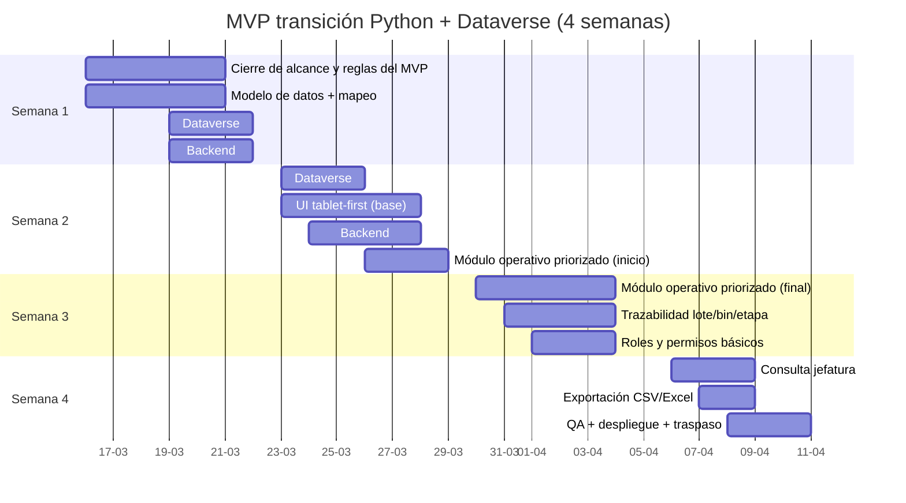
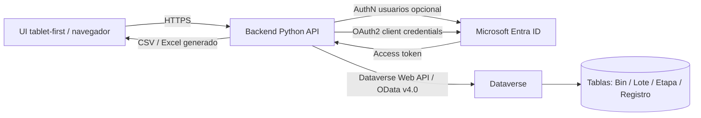

# Preparación preinicio para MVP de transición a framework web Python con Dataverse

## Propósito del documento

Este documento define qué debe estar resuelto antes del kickoff técnico del MVP de transición hacia una solución web propia en Python, utilizando Microsoft Dataverse como base de datos e integración principal.

Su objetivo es reducir incertidumbre operativa y técnica antes del inicio del desarrollo, dejando explícitos:

- el alcance real del MVP;
- los supuestos de trabajo;
- los prerrequisitos de acceso e infraestructura;
- el inventario mínimo de datos;
- la arquitectura de integración Python–Dataverse;
- los riesgos principales;
- los criterios de aceptación;
- y las tareas de validación previas al kickoff.

---

## Resumen ejecutivo

El MVP corresponde a una primera etapa funcional de transición hacia un framework web Python con backend propio, utilizando Microsoft Dataverse como sistema de registro.

El foco del MVP es un flujo **tablet-first** con trazabilidad básica por:

**Bin → Lote → Etapa**

La solución considera:

- registro y actualización de información operativa por etapa;
- control básico de acceso según perfil;
- una vista simple de consulta para jefatura;
- y exportación básica para continuidad operativa.

La integración técnica se realiza desde el backend Python hacia Dataverse mediante **Dataverse Web API (OData v4.0)**.

### Condiciones críticas antes de iniciar

Para iniciar sin fricción, deben quedar resueltos antes del kickoff:

1. Ambiente Dataverse operativo y accesible.
2. Permisos correctos para desarrollo y administración del modelo.
3. Registro de aplicación en Microsoft Entra ID.
4. Usuario de aplicación en Dataverse para autenticación servidor a servidor (S2S).
5. Inventario mínimo de datos y reglas de calidad definidas.
6. Alcance acotado del MVP validado por escrito.
7. Criterios de aceptación acordados.

---

## Alcance consolidado del MVP

Esta etapa corresponde a una **fase inicial funcional** y no al sistema completo.

### Incluye

- cierre funcional del flujo priorizado;
- diseño del modelo mínimo de datos;
- mapeo desde planillas Excel o sistema actual hacia Dataverse;
- creación o ajuste mínimo de tablas y columnas necesarias;
- backend Python con autenticación y conexión a Dataverse;
- interfaz web responsive para uso en tablet;
- módulo operativo priorizado con validaciones esenciales;
- trazabilidad básica por lote, bin y etapa;
- control de acceso básico por perfil o etapa;
- vista simple de consulta para jefatura;
- exportación básica CSV o Excel;
- despliegue, pruebas y documentación mínima de operación.

### No incluye en esta etapa

- implementación completa de todo el flujo operacional;
- reportería avanzada o dashboards analíticos;
- procesos complejos de automatización fuera del flujo crítico;
- arquitectura enterprise completa;
- migración masiva de datos históricos sin depuración previa;
- controles avanzados no priorizados por el negocio.

---

## Supuestos de trabajo

Para mantener el proyecto dentro de una ventana realista de 4 semanas, se asumen las siguientes restricciones:

- Se prioriza **una sola etapa operativa** como foco del MVP, por ejemplo recepción o cámara.
- Dataverse será el **sistema de registro principal**.
- No se implementará una base de datos paralela para el MVP.
- La integración se hará vía **Dataverse Web API**.
- La autenticación del backend a Dataverse será por **OAuth 2.0 client credentials** con **Application User**.
- La consulta de jefatura y la exportación serán mínimas y funcionales, no analíticas.
- La carga inicial de datos se limitará a catálogos, referenciales y semillas necesarias para operar.

---

## Entregables esperados al cierre de las 4 semanas

### Entregables funcionales

- Web app tablet-first accesible por URL.
- Registro y actualización operativa de una etapa priorizada.
- Asociación entre lote y bin.
- Captura de campos operativos mínimos.
- Registro de trazabilidad básica por lote, bin y etapa.
- Acceso diferenciado entre operador y jefatura.
- Vista de consulta con filtros mínimos.
- Exportación básica CSV o Excel.

### Entregables técnicos

- Tablas y columnas mínimas implementadas en Dataverse.
- Solución del MVP organizada en entorno de desarrollo.
- Backend Python conectado a Dataverse.
- Adquisición de token y consumo de `/api/data/v9.2/`.
- Manejo básico de errores y reintentos.
- Documento de configuración y operación.
- Checklist de pruebas ejecutado.
- Criterios de aceptación verificables.

---

## Plan de trabajo referencial de 4 semanas

> La planificación base considera **160 horas** en total.

## Desglose semanal estimado

| Semana | Actividad | Horas estimadas |
|---|---|---:|
| 1 | Levantamiento funcional y cierre de alcance del MVP | 14 |
| 1 | Diseño del modelo de datos y mapeo Excel → Dataverse | 12 |
| 1 | Ajustes o creación inicial de tablas y columnas en Dataverse | 6 |
| 1 | Backend Python: esqueleto, autenticación y conexión a Dataverse | 8 |
| 2 | Ajustes o creación final de tablas y columnas | 8 |
| 2 | UI web responsive tablet-first | 14 |
| 2 | Backend Python: endpoints funcionales del MVP | 8 |
| 2 | Módulo operativo priorizado (inicio) | 10 |
| 3 | Módulo operativo priorizado (final) | 14 |
| 3 | Trazabilidad por lote, bin y etapa | 14 |
| 3 | Roles y permisos básicos por perfil | 12 |
| 4 | Vista básica de consulta para jefatura | 12 |
| 4 | Exportación simple CSV/Excel | 8 |
| 4 | Despliegue, pruebas integrales, hardening y traspaso | 20 |

### Gantt referencial



> La fecha de inicio es referencial y debe ajustarse al kickoff real.

---

## Requisitos técnicos y accesos necesarios antes de iniciar

## Prerrequisitos de Dataverse / Power Platform

- Tenant Power Platform disponible.
- Al menos un ambiente Dataverse operativo.
- Idealmente separación entre **Dev/Sandbox** y **Producción**.
- Permisos suficientes para crear tablas, columnas, relaciones, soluciones y seguridad.

### Rol mínimo esperado para desarrollo

- **System Administrator**, o
- **System Customizer** con los permisos adicionales necesarios según alcance.

## Prerrequisitos de identidad y autenticación

- Registro de aplicación en **Microsoft Entra ID** para el backend.
- Credencial del aplicativo:
  - secret, o preferiblemente,
  - certificado.
- Creación de **Application User** en Dataverse asociado al service principal.
- Scope recomendado para client credentials:

```text
<environment-url>/.default
```

## Prerrequisitos de hosting

Si el despliegue será en Azure, definir desde el inicio:

- servicio de hosting;
- URL objetivo;
- dominio y certificado TLS/SSL si aplica;
- estrategia de autenticación de la aplicación;
- gestión de secretos;
- ambiente de pruebas y despliegue.

---

## Checklist de accesos y documentos a solicitar al cliente

| Ítem a solicitar | Responsable típico | Uso | Bloquea si falta |
|---|---|---|---|
| URL del ambiente Dataverse | Admin Power Platform | Construcción de endpoints Web API | Sí |
| Acceso del desarrollador al ambiente | Admin Power Platform | Crear y editar tablas, soluciones y seguridad | Sí |
| Lista de tablas existentes y dueños funcionales | Power Platform Lead | Reutilizar modelo existente y evitar duplicidad | Parcial |
| Tenant ID y datos del entorno | Admin Entra / IT | Registro de app y emisión de tokens | Sí |
| Client ID y credencial del app registration | Admin Entra / IT | OAuth2 client credentials | Sí |
| Application User en Dataverse con rol asignado | Admin Power Platform | Permisos S2S del backend | Sí |
| Políticas de seguridad y conditional access | IT Seguridad | Validar restricciones y excepciones | Parcial |
| Hosting decidido y accesos | IT Infra | Publicación de la aplicación | Parcial |
| Dominio/SSL requerido o no | IT / Negocio | Definir URL final | No, si es piloto |
| Plantillas Excel actuales y ejemplos reales | Negocio | Mapeo de datos y validaciones | Sí |
| Catálogo de etapas y reglas por etapa | Negocio | Definir flujo y permisos | Sí |
| Lista de usuarios y roles operativos | Negocio / IT | Configurar perfiles y asignaciones | Sí |
| Criterios de aceptación y exclusiones | Sponsor / PO | Evitar scope creep | Sí |

---

## Inventario mínimo de datos para el MVP

Para operar el flujo **Bin → Lote → Etapas** sin ambigüedad, el inventario mínimo recomendado es:

### Tablas mínimas

- **Bin**: código, tipo, estado, ubicación.
- **Lote**: identificador, fecha, producto o variedad, estado.
- **Etapa**: nombre, orden, reglas mínimas.
- **Registro / Trazabilidad**: lote, bin, etapa, usuario, timestamp, estado, datos capturados.
- **Asignación usuario-etapa**: usuario, etapa, permisos, si la lógica se implementa a nivel de aplicación.

### Recomendaciones de modelado

- Usar tipos de columna correctos desde el inicio.
- Definir catálogos controlados para estados.
- Evitar textos libres donde haya lógica operacional.
- Definir zona horaria estándar del proyecto.

### Zona horaria recomendada

```text
America/Santiago
```

---

## Estrategia de indexación e integración

## Claves alternativas para Bin y Lote

Cuando el negocio trabaja con códigos operativos en lugar de GUIDs, conviene definir **alternate keys** en Dataverse para:

- búsquedas confiables por código de negocio;
- operaciones upsert;
- integraciones más simples desde backend;
- menor dependencia del GUID para lógica operacional.

### Recomendación

- `bin_code` como clave alternativa de Bin.
- `lote_number` como clave alternativa de Lote.

---

## Estrategia de carga inicial

Para el MVP, la carga debe mantenerse pequeña y controlada.

### Prioridad de carga

1. Catálogos y tablas referenciales.
2. Datos semilla necesarios para operar.
3. Datos operativos mínimos de prueba.

### Opciones de carga

- Importación desde Excel o CSV.
- Dataflows, si se requiere transformación.
- Carga programática vía Web API, si el proceso será repetible.

---

## Controles mínimos de calidad de datos antes de cargar

- Duplicados de bin o lote según clave de negocio.
- Nulos en campos obligatorios.
- Normalización de códigos.
- Estados fuera de catálogo.
- Fechas inválidas o inconsistentes.
- Valores de texto con espacios, casing o formato no controlado.

---

## Plantilla base de mapeo origen → Dataverse

| Campo origen | Campo Dataverse | Tipo | Notas / reglas |
|---|---|---|---|
| Bin | `bin.bin_code` | Texto | Clave alternativa recomendada; normalizar mayúsculas |
| EstadoBin | `bin.status` | Choice | Catálogo controlado |
| Lote | `lote.lote_number` | Texto | Clave alternativa recomendada |
| FechaLote | `lote.production_date` | Fecha | Definir zona horaria |
| Etapa | `etapa.stage_name` | Texto / Choice | Definir catálogo y orden |
| UsuarioOperador | `registro.operator_upn` | Texto | Idealmente UPN Entra o lookup |
| Timestamp | `registro.event_datetime` | Fecha/Hora | Registrar evento por etapa |
| Cantidad | `registro.quantity` | Número | Definir unidad |
| Observación | `registro.notes` | Texto multilínea | Definir longitud máxima |
| Centro / Planta | `registro.site` | Lookup / Choice | Solo si el alcance lo requiere |

---

## Arquitectura recomendada del MVP

### Vista general



### Principios de arquitectura

- La UI no consume Dataverse directamente.
- El backend Python centraliza reglas, validaciones e integración.
- Dataverse mantiene el modelo y el registro operativo.
- La exportación se genera desde el backend.
- La autenticación técnica con Dataverse se realiza por S2S.

---

## Autenticación práctica del backend

### Patrón recomendado

- OAuth 2.0 **client credentials**.
- App Registration en Entra ID.
- Application User en Dataverse.
- Scope `/.default` del entorno.

### Base típica del endpoint

```text
https://<organization>.crm.dynamics.com/api/data/v9.2/
```

### Consideraciones

- Mantener client secret o certificado fuera del código.
- Preferir variables de entorno o Azure Key Vault.
- Validar token con una llamada inicial de prueba, por ejemplo `WhoAmI`.

---

## Patrones de acceso a datos

### Lectura

- uso de `$select`;
- uso de `$filter`;
- paginación;
- consultas pequeñas y acotadas.

### Escritura

- `POST` para crear;
- `PATCH` para actualizar;
- `Upsert` cuando existan claves alternativas.

### Rendimiento

- usar `$batch` cuando una operación requiera múltiples escrituras;
- evitar consultas masivas innecesarias;
- implementar reintentos con backoff.

---

## Concurrencia y control de edición

En operación real, dos usuarios pueden intentar modificar el mismo lote o bin al mismo tiempo.

### Riesgo

- sobrescritura silenciosa de cambios;
- pérdida de información operativa;
- estado inconsistente entre etapas.

### Estrategia recomendada para el MVP

- leer registro y conservar `@odata.etag`;
- actualizar usando encabezado `If-Match`;
- si existe conflicto, reconsultar y decidir resolución.

### Flujo recomendado

```text
leer registro → guardar etag → intentar actualización con If-Match →
si hay mismatch: reconsultar / resolver / reintentar
```

---

## Límites de API y resiliencia

Dataverse aplica límites de protección de servicio y puede responder con errores por exceso de solicitudes o consultas costosas.

### El backend debe contemplar

- reintentos con backoff;
- paginación;
- control de volumen de lectura;
- uso prudente de `$batch`;
- logs mínimos para soporte.

---

## Checklist de pruebas del MVP

### Autenticación y seguridad

- [ ] La aplicación requiere autenticación si así se definió.
- [ ] El backend obtiene token correctamente.
- [ ] La llamada `WhoAmI` responde correctamente.
- [ ] El Application User tiene permisos mínimos necesarios.
- [ ] Los roles de Dataverse están asignados según perfil.

### Flujo operativo

- [ ] Se puede crear un registro de lote/bin en la etapa priorizada.
- [ ] Se puede actualizar el estado o avance.
- [ ] Las validaciones obligatorias funcionan.
- [ ] Se registra trazabilidad con timestamp y usuario.

### Consulta y exportación

- [ ] Los filtros mínimos funcionan.
- [ ] La exportación respeta filtros aplicados.
- [ ] El formato exportado es usable operativamente.

### Concurrencia y resiliencia

- [ ] `If-Match` detecta conflictos de edición.
- [ ] Los reintentos frente a throttling están implementados.
- [ ] La interfaz no se rompe en tablet.

---

## Criterios de aceptación

El MVP puede considerarse aceptado cuando se cumpla lo siguiente:

1. Un operador puede registrar y actualizar la etapa priorizada para un lote o bin.
2. La información queda persistida correctamente en Dataverse.
3. Un usuario de jefatura puede consultar registros con filtros mínimos.
4. La jefatura puede exportar la información básica requerida.
5. La interfaz funciona correctamente en tablet.
6. Se entrega documentación mínima de configuración, operación y límites conocidos.

---

## Riesgos principales y mitigaciones

| Riesgo | Señal temprana | Mitigación |
|---|---|---|
| Retraso en accesos | Día 1 sin permisos ni ambiente funcional | Tratar checklist de accesos como condición de kickoff |
| Expansión de alcance | Nuevas etapas o validaciones en semana 2 | Acordar por escrito una etapa priorizada y gestionar cambios aparte |
| Datos sucios o inconsistentes | Duplicados, códigos distintos, formatos mixtos | Reglas de normalización, claves alternativas y carga controlada |
| Throttling o límites API | Errores 429, lentitud | Backoff, paginación, batch y consultas acotadas |
| Concurrencia operativa | Cambios pisados entre usuarios | ETag + If-Match + manejo de conflictos |
| Hosting indefinido | No existe URL para publicar al final | Definir hosting desde semana 1, aunque sea temporal |

---

## Preguntas que deben quedar resueltas antes del kickoff

- ¿Cuál es exactamente la etapa priorizada del MVP?
- ¿Qué campos captura esa etapa?
- ¿Qué representa operacionalmente un bin?
- ¿Qué representa operacionalmente un lote?
- ¿Cuál es la regla de unicidad de cada uno?
- ¿Qué perfiles existen y qué puede hacer cada perfil?
- ¿Qué excepciones operativas se permiten?
- ¿Qué formato exacto debe tener la exportación?
- ¿Qué campos son obligatorios y cuáles opcionales?
- ¿Qué estados están permitidos por etapa?

---

## Artefactos a solicitar antes del día 1

- Plantillas Excel actuales.
- Formularios o registros usados hoy en operación.
- Ejemplos reales de datos.
- Catálogo de etapas.
- Reglas por etapa.
- Lista de usuarios con UPN y rol.
- Definición de estados válidos.
- Confirmación de exclusiones del alcance.

---

## Validaciones exploratorias recomendadas para el primer día

- Descargar `$metadata` del ambiente Dataverse.
- Ejecutar `WhoAmI` para probar autenticación y permisos.
- Revisar tablas ya existentes y evaluar reutilización.
- Ensayar actualización condicional con ETag / If-Match.
- Probar `$batch` si habrá múltiples escrituras por acción.

---

## Herramientas recomendadas

- **Postman** o **Insomnia** para probar Dataverse Web API.
- **Power Platform CLI (`pac`)** para soluciones y operaciones de ALM.
- Solución del MVP organizada desde el inicio.
- Repositorio Git con estructura separada para backend, arquitectura y documentación.

---

## Referencias oficiales sugeridas

### Dataverse y autenticación

- Dataverse Web API overview  
  https://learn.microsoft.com/es-es/power-apps/developer/data-platform/webapi/overview
- OAuth con Dataverse  
  https://learn.microsoft.com/es-es/power-apps/developer/data-platform/authenticate-oauth
- Autenticación S2S y Application User  
  https://learn.microsoft.com/es-es/power-apps/developer/data-platform/build-web-applications-server-server-s2s-authentication
- WhoAmI  
  https://learn.microsoft.com/es-es/power-apps/developer/data-platform/webapi/reference/whoami

### Dataverse modelado y operaciones

- Soluciones en Power Apps  
  https://learn.microsoft.com/es-es/power-apps/maker/data-platform/solutions-overview
- Tablas en Dataverse  
  https://learn.microsoft.com/es-es/power-apps/maker/data-platform/entity-overview
- Tipos de datos de columna  
  https://learn.microsoft.com/es-es/power-apps/maker/data-platform/types-of-fields
- Claves alternativas  
  https://learn.microsoft.com/es-es/power-apps/maker/data-platform/define-alternate-keys-portal
- Upsert  
  https://learn.microsoft.com/es-es/power-apps/developer/data-platform/use-upsert-insert-update-record
- Batch operations  
  https://learn.microsoft.com/es-es/power-apps/developer/data-platform/webapi/execute-batch-operations-using-web-api
- Operaciones condicionales con ETag / If-Match  
  https://learn.microsoft.com/es-es/power-apps/developer/data-platform/webapi/perform-conditional-operations-using-web-api
- Límites de API  
  https://learn.microsoft.com/es-es/power-apps/developer/data-platform/api-limits

### Carga inicial de datos

- Importación y exportación de datos  
  https://learn.microsoft.com/es-es/power-apps/maker/data-platform/data-platform-import-export
- Dataflows  
  https://learn.microsoft.com/es-es/power-apps/maker/data-platform/create-and-use-dataflows

### Seguridad y roles

- Asignación de roles de seguridad  
  https://learn.microsoft.com/es-es/power-platform/admin/assign-security-roles
- Application Users  
  https://learn.microsoft.com/es-es/power-platform/admin/manage-application-users
- Conceptos de seguridad en Dataverse  
  https://learn.microsoft.com/es-es/power-platform/admin/wp-security-cds

### Azure, si aplica

- Quickstart Python en Azure App Service  
  https://learn.microsoft.com/es-es/azure/app-service/quickstart-python
- Autenticación en Azure App Service  
  https://learn.microsoft.com/es-es/azure/app-service/overview-authentication-authorization
- Dominio personalizado y certificado  
  https://learn.microsoft.com/es-es/azure/app-service/tutorial-secure-domain-certificate
- Azure Key Vault secretos  
  https://learn.microsoft.com/es-es/azure/key-vault/secrets/

---

## Decisión documental recomendada dentro del repositorio

Este archivo debe almacenarse en:

```text
arquitectura/preinicio/README.md
```

Y complementarse con:

- `arquitectura/README.md` como índice general de arquitectura;
- `docs/` para documentación operativa y de despliegue;
- `python-app/README.md` para backend;
- `power-platform/README.md` para Dataverse, soluciones y tablas.

---

## Estado esperado para declarar kickoff técnico habilitado

El kickoff puede considerarse técnicamente habilitado cuando:

- el ambiente Dataverse está confirmado;
- el desarrollador ya tiene acceso;
- existe app registration válido;
- el Application User ya está creado y con rol asignado;
- el alcance de la etapa priorizada quedó cerrado;
- existen ejemplos reales de datos;
- están definidos usuarios, roles y criterios de aceptación;
- la estrategia de hosting está al menos decidida.

---

## Nota final

Este documento no reemplaza la planificación detallada en issues, milestones o backlog, pero sí establece la base mínima para iniciar el MVP sin bloqueos previsibles.
