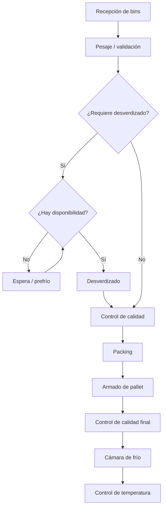

# Actualización del plan de preparación y entrega del MVP utilizable, alineado a Dataverse (wiki 03.x)

> **Nota de vigencia:** este documento sigue siendo un artefacto de planificación histórica, pero fue ajustado para que no contradiga la estructura rectora definida en la wiki **03.x**.
>
> Debe servir como referencia para agentes y colaboradores, siempre bajo esta regla: **si hay diferencia entre este archivo y la wiki 03.x, prevalece la wiki**.

---

## Propósito del documento

Dejar el plan histórico alineado con:

- el modelo de datos rector definido en Dataverse;
- la nomenclatura vigente de entidades y códigos;
- el flujo operativo priorizado actualmente documentado;
- y la separación correcta entre:
  - modelo funcional/documental;
  - implementación local en Django;
  - e integración técnica con Dataverse.

---

## Resumen ejecutivo actualizado

El MVP debe seguir siendo **funcional y usable en terreno**, pero su documentación no puede seguir arrastrando ambigüedades del modelo local inicial.

La estructura de referencia para cualquier avance futuro debe asumir que:

- el **modelo rector** está en Dataverse;
- la wiki **03.2, 03.3 y 03.4** define cómo deben entenderse entidades, relaciones y mapeo;
- el backend Python actúa como capa de:
  - validación,
  - integración,
  - trazabilidad,
  - orquestación,
  - y soporte de operación local o remota.

El plan sigue siendo válido como guía de ejecución, pero corrigiendo especialmente:

- el uso del nombre **LotePlanta** en lugar de **Lote** como entidad rectora;
- la lectura de los códigos operativos como atributos del modelo y no como reemplazo del identificador técnico;
- la distinción entre relaciones funcionales del modelo y tablas de apoyo propias del backend local.

---

## Corrección conceptual obligatoria

### Lo que ya no debe asumirse

No debe seguir asumiéndose que el modelo final del MVP es simplemente:

- Bin
- Lote
- Pallet
- BinLote
- PalletLote
- RegistroEtapa

porque esa forma corresponde al **modelo local inicial de implementación** y no necesariamente al contrato rector de Dataverse.

### Lo que debe asumirse ahora

Para fines de planificación y ejecución, debe entenderse que la referencia vigente es la estructura documentada en 03.x, donde al menos:

- **Bin** sigue siendo entidad clave de entrada;
- **LotePlanta** es la agrupación operacional de planta que reemplaza el uso ambiguo de “Lote” como nombre rector;
- **Pallet** permanece como unidad posterior de consolidación;
- **Desverdizado** debe mantenerse como parte explícita del flujo y del modelo;
- los IDs técnicos y los códigos de negocio deben tratarse por separado.

---

## Alcance actualizado del MVP

### Incluye

- recepción y validación de bins preexistentes;
- generación o asociación operativa con **LotePlanta** según reglas de planta;
- registro del paso por desverdizado cuando aplique;
- continuidad operacional hacia packing y consolidación posterior;
- construcción de registros y consultas con nomenclatura alineada a Dataverse;
- backend Python preparado para ejecutar el mismo flujo en:
  - modo local con SQLite,
  - o modo real contra Dataverse;
- documentación suficiente para que un agente automático continúe el trabajo sin tomar decisiones de modelado contradictorias.

### No incluye

- reinterpretar el modelo Dataverse desde el backend;
- inventar tablas nuevas por conveniencia documental;
- inflar el MVP con especializaciones no definidas en la wiki 03.x;
- usar documentos históricos como si fueran contrato de datos definitivo.

---

## Flujo operativo a considerar documentalmente

Este plan debe leerse alineado con el flujo operativo prioritario del proyecto:

### Lectura correcta del flujo

- el bin entra como dato operacional de origen;
- en planta se conforma o usa el concepto de **LotePlanta**;
- desverdizado no se elimina del alcance documental;
- pallet es una entidad operacional posterior al packing;
- el flujo físico y el modelo Dataverse deben leerse coordinadamente, no como dos verdades distintas.

---

## Entidades mínimas que el plan debe respetar

| Entidad / concepto | Rol |
|---|---|
| **Temporada** | Base temporal para correlatividad y control operacional. |
| **Bin** | Unidad operacional recibida. |
| **LotePlanta** | Agrupación interna de planta. |
| **Desverdizado** | Proceso intermedio cuando la fruta lo requiere. |
| **Pallet** | Consolidación posterior a packing. |
| **Planta / contexto operacional** | Referencia de operación o localización según el modelo 03.x. |
| **Códigos de negocio** | Valores visibles al usuario, por ejemplo `id_bin`, `code_lote_planta`, `code_pallet` o equivalentes vigentes. |

---

## Regla de trabajo para backend y agentes

Cuando un agente lea este archivo para avanzar en el proyecto, debe interpretar lo siguiente:

### A. Sobre el modelo

- usar la wiki 03.x como verdad del modelo;
- usar este plan solo como guía de ejecución;
- no asumir que las tablas locales de Django equivalen 1:1 a Dataverse.

### B. Sobre el naming

- preferir `LotePlanta` frente a `Lote` cuando se hable de la entidad del proceso planta;
- mantener consistencia entre documentación, tests, DTOs y payloads;
- separar claramente:
  - `id_*` o GUID interno,
  - `code_*` o código operacional visible.

### C. Sobre el mapeo

- todo cambio que toque persistencia debe dejar explícito el mapeo local ↔ Dataverse;
- si el backend mantiene nombres históricos por compatibilidad, eso debe quedar documentado como compatibilidad transitoria.

---

## Ajustes recomendados al roadmap técnico

El roadmap sigue siendo funcional, pero debe incorporar estas tareas explícitas:

### Línea de trabajo documental

- [ ] corregir documentos históricos para que usen la nomenclatura 03.x;
- [ ] eliminar ambigüedad entre `Lote` y `LotePlanta`;
- [ ] documentar la diferencia entre ID interno y código de negocio;
- [ ] documentar el mapeo local ↔ Dataverse.

### Línea de trabajo backend

- [ ] adaptar DTOs y casos de uso a nombres alineados;
- [ ] revisar tests unitarios que aún usen nombres antiguos;
- [ ] centralizar mapeo Dataverse en una sola capa;
- [ ] evitar que serializers o vistas propaguen naming obsoleto.

### Línea de trabajo integración

- [ ] definir mapeo de columnas y lookups según 03.4;
- [ ] validar claves de negocio visibles para operación;
- [ ] preparar selector de persistencia local / Dataverse;
- [ ] mantener comportamiento funcional equivalente en ambos modos.

---

## Contrato mínimo para continuidad del trabajo

Para dejar al agente avanzando sin inducir errores de modelado, este documento establece el siguiente contrato mínimo:

1. **No renombrar entidades por intuición.**
2. **No usar el modelo Django como fuente de verdad contractual.**
3. **No crear documentación nueva contradiciendo 03.x.**
4. **Todo cambio técnico debe declarar la entidad Dataverse afectada.**
5. **Si existe diferencia entre naming histórico y naming vigente, migrar gradualmente al naming vigente.**

---

## Riesgos principales si no se alinea la documentación

| Riesgo | Efecto |
|---|---|
| Mantener “Lote” como nombre rector | Confusión entre lote funcional, lote planta y relación operativa real. |
| Seguir documentando BinLote/PalletLote como modelo final | El agente puede modelar Dataverse según el espejo local y no según el diseño real. |
| No separar ID técnico y código visible | Errores en integraciones, consultas y lógica de correlativos. |
| Eliminar o minimizar Desverdizado documentalmente | Se rompe la coherencia con el flujo real acordado. |
| Mezclar trazabilidad con entidades maestras | El backend termina sobredocumentando eventos como si fueran el núcleo del modelo. |

---

## Dependencias críticas

- wiki 03.x actualizada y considerada como referencia principal;
- definición vigente de nombres de entidades y códigos;
- mapeo Dataverse formalizado para el backend;
- consistencia entre documentación, tests e implementación.

---

## Conclusión técnica

Este documento ya no debe leerse como un plan que “define” el modelo, sino como un plan que **ejecuta sobre un modelo ya definido en la wiki 03.x**.

La corrección más importante para cualquier agente o colaborador es esta:

- **Dataverse es el modelo rector**;
- **LotePlanta reemplaza al uso ambiguo de Lote como nombre documental principal**;
- **el backend Django es una implementación alineada, no la especificación maestra**.

Eso permite seguir avanzando en el MVP sin frenar la ejecución, pero evitando que el trabajo futuro se base en una estructura documental desfasada.
