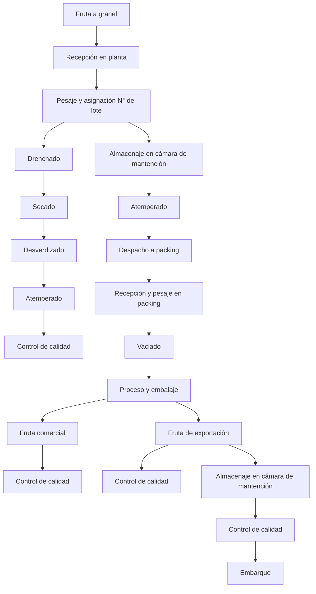
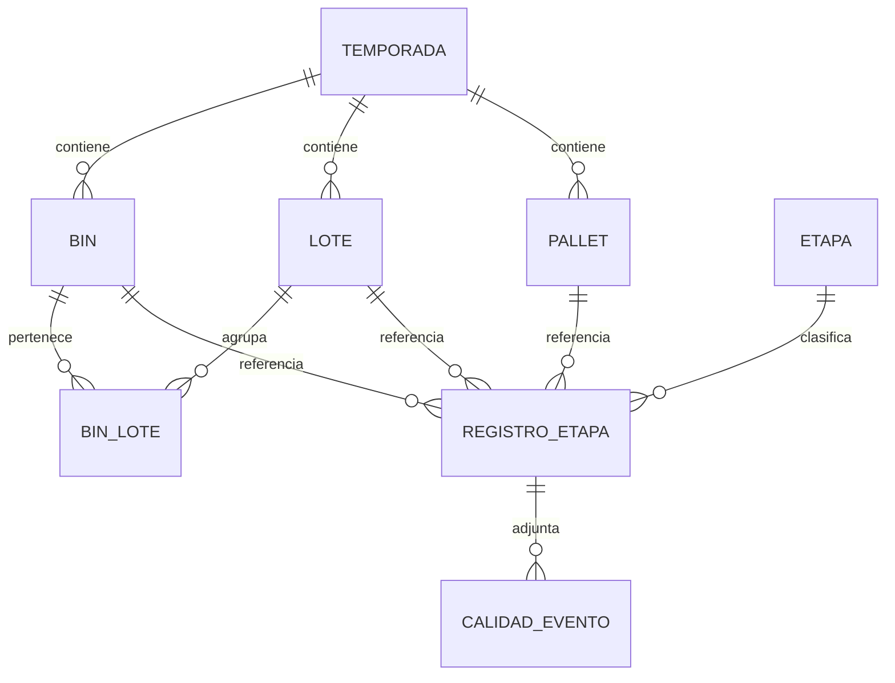
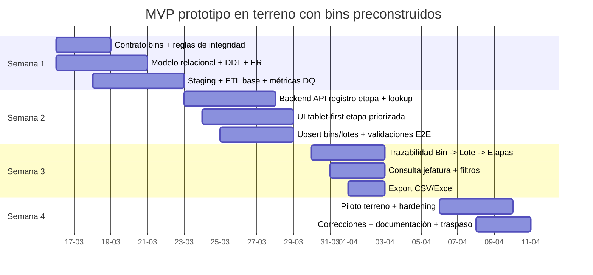

# Actualización del plan de preparación y entrega del MVP utilizable en terreno con bins preconstruidos

> **Nota:** Este documento es un **artefacto de planificación histórico** (versión 2 del plan). Refleja el diseño y alcance acordado antes del inicio del desarrollo. Los Pasos 1, 2 y 3 descritos en el roadmap están completados. Para el estado actual del proyecto, ver [docs/planning/README.md](../planning/README.md) y la [wiki del proyecto](https://github.com/s4mu31m/mvp-packing-exportacion/wiki/09-Planificacion-y-roadmap).

---

## Propósito del documento

Este documento corresponde a la **versión 2** del plan de preparación para el MVP y consolida las actualizaciones entregadas por el cliente sobre el flujo real de operación.

Su objetivo es dejar alineados, en un solo documento:

- el cambio contractual de **bins preconstruidos**;
- el alcance real del MVP utilizable en terreno;
- la adaptación del plan al **diagrama de flujo operativo actualizado** compartido por el cliente;
- el modelo lógico mínimo necesario para sostener trazabilidad;
- las decisiones de integración con Dataverse y/o backend Python;
- el paquete ETL/ELT y controles de calidad de datos;
- y el cronograma revisado de implementación.

---

## Resumen ejecutivo

La actualización principal de esta versión es que los **bins ya no se construyen en este módulo**. En su lugar, el módulo debe recibirlos desde la etapa anterior como datos ya generados y operar sobre ellos con una lógica centrada en:

- validación de integridad del bin recibido;
- carga idempotente / upsert;
- asociación bin → lote;
- registro por etapa;
- trazabilidad operacional;
- exportación y consulta simple para continuidad operativa.

Esto reduce complejidad de cálculo, pero **eleva fuertemente la criticidad del contrato de entrada**, la validación de datos y la consistencia operacional entre etapas.

La recomendación técnica base se mantiene:

- **frontend web tablet-first**;
- **backend Python** para lógica e integración;
- **Dataverse** como sistema de registro si el cliente ya está estandarizado en Power Platform;
- o alternativamente **PostgreSQL** si se requiere mayor control relacional fuera de ese ecosistema.

---

## Cambio clave respecto a la versión anterior

### Antes

El plan asumía mayor peso funcional en la construcción o composición del bin dentro del mismo módulo.

### Ahora

El plan actualizado asume que:

- el bin llega **preconstruido** desde el módulo previo;
- este módulo **no recalcula el bin**;
- este módulo debe **recibir, validar, insertar/actualizar, relacionar y trazar**;
- el foco pasa desde “generación” a **integración operativa + calidad de datos + trazabilidad**.

### Impacto real de este cambio

1. Disminuye la lógica de negocio de construcción de bins.
2. Aumenta el peso de las reglas de integridad y unicidad.
3. Hace indispensable un contrato formal con el upstream.
4. Obliga a modelar correctamente las transiciones entre etapas.
5. Vuelve crítica la idempotencia para cargas repetidas.

---

## Alcance actualizado del MVP

El MVP debe ser suficientemente funcional para usarse en terreno, aunque todavía no represente el sistema completo.

### Incluye

- recepción de bins preconstruidos;
- validación de código de bin y lote;
- upsert de bins y lotes;
- registro operacional por etapa;
- trazabilidad básica por bin, lote y etapa;
- formulario o flujo tablet-first para captura rápida;
- validaciones mínimas de UI y backend;
- consulta simple para continuidad operacional y jefatura;
- exportación CSV/Excel;
- controles de calidad como registros asociados a etapas;
- despliegue piloto y checklist de uso en terreno.

### No incluye en esta etapa

- reconstrucción lógica del bin dentro del módulo;
- reportería avanzada;
- automatizaciones complejas no prioritarias;
- totalidad del ecosistema productivo;
- migración histórica completa sin depuración previa;
- IAM enterprise completo fuera de lo necesario para operar.

---

## Validación contra el diagrama de flujo operativo del cliente

### Conclusión de compatibilidad

El plan **sí puede adaptarse al diagrama compartido por el cliente**, pero requiere un ajuste importante de modelado:

- el documento v2 ya representa correctamente el eje de trazabilidad **Bin → Lote → Etapas**;
- el diagrama del cliente agrega mayor detalle operativo entre recepción, desverdizado, despacho a packing, packing comercial y fruta de exportación;
- por lo tanto, el modelo debe distinguir entre:
  - **etapas con tabla propia**;
  - **subetapas o hitos operativos** que pueden vivir inicialmente en `registro_etapa` sin tabla especializada;
  - **controles de calidad** como eventos flexibles ligados a múltiples puntos del flujo.

En términos prácticos, el documento v2 es **compatible con el flujo del cliente**, pero para que quede realmente alineado conviene explicitar etapas intermedias que en el PDF técnico estaban implícitas o consolidadas.

---

## Flujo operativo adaptado al diagrama del cliente



### Lectura de este flujo

El flujo entregado por el cliente muestra dos grandes comportamientos:

1. **Ruta de acondicionamiento previa al packing**
   - recepción;
   - pesaje/asignación de lote;
   - drenchado;
   - secado;
   - desverdizado;
   - atemperado;
   - control de calidad.

2. **Ruta de packing y clasificación final**
   - almacenaje / espera;
   - despacho a packing;
   - recepción y pesaje en packing;
   - vaciado;
   - proceso y embalaje;
   - salida a fruta comercial o fruta de exportación;
   - almacenamiento y embarque para exportación.

---

## Matriz de adaptación: plan v2 vs diagrama del cliente

| Etapa del diagrama del cliente | Estado en el plan v2 | Recomendación de modelado |
|---|---|---|
| Recepción en planta | Cubierta | Tabla/etapa `recepcion` |
| Pesaje y asignación N° lote | Cubierta | Tabla/etapa `pesaje_lote` |
| Drenchado | Parcial / implícita | Crear etapa de catálogo o subetapa en `registro_etapa` |
| Secado | Parcial / implícita | Crear etapa de catálogo o subetapa en `registro_etapa` |
| Desverdizado | Cubierta | Tabla/etapa `desverdizado` |
| Atemperado posterior a desverdizado | Parcial | Registrar como etapa específica o atributo del proceso |
| Control de calidad | Cubierta conceptualmente | Usar `calidad_evento` flexible por etapa |
| Almacenaje en cámara de mantención | Parcial | Registrar como etapa logística |
| Despacho a packing | Parcial | Registrar como etapa logística |
| Recepción y pesaje en packing | Parcial | Crear etapa específica o consolidar con pesaje/packing |
| Vaciado | Parcial | Etapa específica mínima en `registro_etapa` |
| Proceso y embalaje | Cubierta parcialmente | Mapear a `packing_proceso` y `control_proceso_packing` |
| Fruta comercial | Parcial | Modelar como resultado o clasificación de salida |
| Fruta de exportación | Parcial | Modelar como clasificación de salida + continuidad logística |
| Cámara de mantención final | Parcial | Relacionar con `camaras_frio` o etapa equivalente |
| Embarque | Parcial | Crear etapa/hito de salida final |

---

## Ajustes recomendados para que el modelo quede realmente alineado

### 1) Mantener el núcleo relacional ya propuesto

El núcleo sigue siendo correcto:

- `temporada`
- `bin`
- `lote`
- `bin_lote`
- `pallet`
- `etapa`
- `registro_etapa`
- `calidad_evento`

### 2) Ampliar el catálogo de etapas

Además de las etapas técnicas ya consideradas en el plan v2, conviene registrar explícitamente en `etapa` los siguientes códigos operativos:

- `recepcion_planta`
- `pesaje_asignacion_lote`
- `drenchado`
- `secado`
- `desverdizado`
- `atemplado`
- `almacenaje_mantencion`
- `despacho_packing`
- `recepcion_pesaje_packing`
- `vaciado`
- `packing_proceso`
- `packing_control`
- `fruta_comercial`
- `fruta_exportacion`
- `paletizaje`
- `camara_frio`
- `embarque`
- `control_calidad`

### 3) No obligar tabla especializada para cada etapa desde el día 1

Para no inflar el alcance del MVP, se recomienda dividir las etapas en dos grupos:

#### Etapas con tabla detallada

- recepción
- pesaje de lote
- desverdizado
- packing proceso
- control del proceso packing
- paletizaje
- cámaras de frío

#### Etapas registradas inicialmente solo como evento trazable

- drenchado
- secado
- atemperado
- almacenaje en cámara de mantención
- despacho a packing
- recepción y pesaje en packing
- vaciado
- fruta comercial
- fruta de exportación
- embarque

Esto permite que el modelo quede alineado con el flujo real sin sobrediseñar tablas antes de validar su necesidad operativa.

### 4) Tratar calidad como evento transversal

La decisión de usar una tabla flexible como `calidad_evento` sigue siendo correcta, porque en el diagrama el control de calidad aparece en múltiples nodos del flujo.

La recomendación es que cada control de calidad se registre con:

- referencia a `registro_etapa`;
- nivel o tipo de control;
- payload flexible JSON o columnas mínimas estandarizadas;
- operador;
- fecha/hora;
- observaciones;
- evidencia fotográfica si aplica.

---

## Observación importante sobre paletizaje y cámaras de frío

El plan v2 incluye explícitamente:

- `paletizaje`
- `camaras_frio`

En cambio, el diagrama del cliente se concentra más en el flujo físico visible y **no muestra el paletizaje de forma explícita**.

### Interpretación recomendada

No debe eliminarse del modelo.

Lo correcto es asumir que:

- el diagrama del cliente representa el flujo operacional resumido;
- el plan técnico debe mantener `paletizaje` como etapa formal si existe necesidad real de identificar pallet, destino, cajas por pallet o peso total;
- `cámaras de frío` puede mapearse como formalización del bloque “almacenaje en cámara de mantención” cuando el proceso ya entra en una lógica de salida/exportación.

---

## Modelo lógico propuesto para sostener la trazabilidad

### Entidades núcleo



### Principio operativo central

Toda trazabilidad del MVP debe poder responder estas preguntas:

- ¿qué bin ingresó?
- ¿a qué lote quedó asociado?
- ¿por qué etapas pasó?
- ¿quién registró el movimiento o evento?
- ¿qué controles de calidad tuvo?
- ¿terminó como fruta comercial o fruta de exportación?
- ¿si fue exportación, en qué cámara, pallet o embarque quedó?

---

## Contrato de integración con bins preconstruidos

El contrato con el módulo anterior debe quedar por escrito y ser testeable.

### Debe definir al menos

- formato oficial del código de bin;
- unicidad esperada por temporada;
- campos obligatorios de entrada;
- relación esperada entre bin y lote;
- frecuencia de entrega;
- mecanismo de reenvío;
- regla ante bin desconocido;
- tratamiento de duplicados;
- política de corrección de errores aguas arriba.

### Regla recomendada

- el upstream entrega el bin como **dato maestro**;
- este módulo hace **upsert**;
- si se repite el mismo bin, no se duplica;
- si llega un evento con bin inexistente, se define estrategia:
  - **strict**: se rechaza;
  - **lenient**: se crea placeholder y se marca para corrección posterior.

Para el MVP, la estrategia más segura operativamente suele ser **strict en integraciones automáticas** y **lenient controlado** solo cuando el negocio no puede detener la operación.

---

## Recomendación tecnológica

### Opción recomendada si el cliente ya trabaja con Power Platform

- Dataverse como almacenamiento principal;
- backend Python para lógica, API y validación;
- consumo por Web API OData v4;
- autenticación con Entra ID;
- uso de alternate keys para `BinCode` y `LoteCode`.

### Opción recomendada si se prioriza control relacional clásico

- PostgreSQL como base principal;
- backend Python;
- constraints, índices y `ON CONFLICT` para idempotencia.

### Opción edge/local solo si la conectividad es problemática

- SQLite o Postgres local;
- sincronización diferida;
- disciplina estricta de integridad, backups y exportación.

---

## ETL / ELT y calidad de datos

El paquete de preparación de datos debe dividirse en tres capas:

### 1) Staging

Carga cruda de hojas o archivos de origen sin perder estructura original.

### 2) Core

Modelo tipado y validado que alimenta la operación.

### 3) DQ

Reglas, métricas y auditoría de calidad de datos.

### Reglas mínimas recomendadas

- `bin_code` no nulo y no vacío;
- `bin_code` único por temporada;
- `lote_code` no nulo;
- pesos y kilos no negativos;
- porcentajes entre 0 y 100;
- registro de etapa con referencias requeridas según tipo de etapa;
- trazabilidad de `source_file`, `sheet`, `row_num` o equivalente.

### Métricas mínimas por corrida

- filas leídas;
- filas cargadas;
- filas rechazadas;
- duplicados detectados;
- bins nuevos vs bins existentes;
- errores de integridad;
- tiempo total de corrida.

---

## Repositorio sugerido para el paquete ETL

```text
etl/
├── config/
│   └── schema_mapping.yml
├── sql/
│   ├── ddl_core.sql
│   ├── ddl_stg.sql
│   └── dq_tables.sql
├── src/
│   ├── extract_excel.py
│   ├── load_stg.py
│   ├── transform_core.py
│   ├── dq_checks.py
│   └── export_csv.py
├── logs/
└── reports/
```

---

## Checklist de entrega en terreno

### Datos y contrato

- [ ] Contrato formal de bins y lotes validado.
- [ ] Reglas de integridad y unicidad aprobadas.
- [ ] Estrategia definida para bin desconocido.

### Base de datos

- [ ] Catálogo de etapas creado.
- [ ] Tablas core implementadas.
- [ ] Constraints e índices aplicados.
- [ ] Backups probados.

### Aplicación

- [ ] Flujo de captura rápida probado en tablet.
- [ ] Validaciones mínimas de UI activas.
- [ ] Trazabilidad bin → lote → etapas verificable.
- [ ] Consulta simple para jefatura operativa.
- [ ] Exportación CSV/Excel operativa.

### Seguridad y accesos

- [ ] Ambiente y permisos disponibles.
- [ ] App registration creada.
- [ ] Usuario de aplicación creado si aplica.
- [ ] Secretos/certificados resguardados.

### Operación

- [ ] Prueba piloto con bins reales.
- [ ] Marcha blanca al menos en una línea o turno.
- [ ] Soporte post go-live definido.
- [ ] Capacitación breve entregada.

---

## Cronograma revisado de referencia



---

## Riesgos principales

### Riesgo 1: contrato de bins inconsistente

Si cambia el formato o llegan duplicados no controlados, se rompe la trazabilidad.

### Riesgo 2: permisos o accesos resueltos tarde

Si Dataverse, Entra ID o roles no están listos antes del kickoff, el desarrollo se bloquea.

### Riesgo 3: sobrecarga funcional por intentar modelar todo desde el día 1

El MVP debe priorizar trazabilidad y operación, no exhaustividad documental de todas las variantes del proceso.

### Riesgo 4: brecha entre flujo dibujado y flujo realmente operado en planta

El diagrama del cliente ayuda mucho, pero debe validarse en terreno qué etapas son solo conceptuales y cuáles requieren captura obligatoria en sistema.

### Riesgo 5: UX de captura lenta

Si el flujo en tablet no es rápido y simple, la adopción operativa cae.

---

## Supuestos explícitos

- El bin es único por temporada.
- El lote puede identificarse sin ambigüedad dentro de la campaña.
- El flujo del diagrama del cliente representa el proceso objetivo de esta etapa del MVP.
- No todas las etapas requerirán tabla especializada en la primera entrega.
- Los controles de calidad pueden modelarse como eventos flexibles.
- El cliente entregará acceso a ambiente, permisos y dispositivos de prueba.

---

## Dependencias críticas

- entrega formal del contrato del upstream;
- confirmación de nomenclatura final de bins y lotes;
- acceso técnico al entorno;
- confirmación de dispositivos reales de captura;
- validación del flujo real por personal operativo;
- definición de qué etapas serán obligatorias en el MVP y cuáles solo auditables.

---

## Conclusión técnica

La **versión 2 del plan es compatible con el diagrama operativo actualizado del cliente**, pero la alineación correcta exige distinguir entre:

- núcleo de trazabilidad obligatorio;
- etapas operativas completas con tabla propia;
- subetapas que pueden partir como eventos ligeros;
- y controles de calidad como registros transversales.

La decisión correcta no es rehacer el modelo desde cero, sino **extender el catálogo de etapas y ajustar el flujo documental** para que el sistema refleje el proceso real sin inflar artificialmente el alcance del MVP.

En consecuencia, esta versión debe considerarse la base documental válida para `arquitectura/preinicio` cuando el proyecto ya incorpora:

- bins preconstruidos;
- integración aguas arriba;
- trazabilidad operativa por etapas;
- y el flujo físico actualizado compartido por el cliente.
