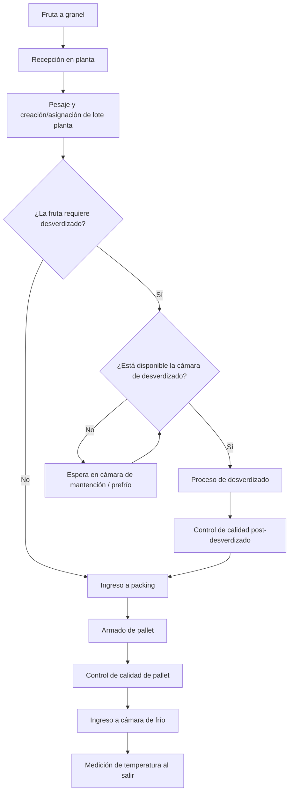

# 03.2 — Especificación del modelo

> **Subpágina de [[03 Modelo de datos y entidades]].** Este documento especifica el modelo de datos implementado en **Dataverse**, que es la base estructural principal de datos del MVP. Dataverse fue solicitado por el cliente para mantener consistencia con sus otros módulos. Django/Python es la capa de lógica, validaciones, cálculos e inserción que opera sobre este modelo objetivo. Refleja el estado acordado al cierre de la etapa de diseño. Las diferencias entre este modelo y lo actualmente implementado en Django son diferencias de avance de implementación, no de criterio.

---

> Este documento especifica el modelo de datos implementado en Dataverse para el MVP Packing Exportación. Refleja el estado acordado al cierre de la etapa de diseño. Cualquier adición deberá versionarse explícitamente.
 
---
 
## Índice
 
1. [Visión general del flujo](#1-visión-general-del-flujo)
2. [Alcance del flujo operativo completo](#2-alcance-del-flujo-operativo-completo)
3. [Convención de códigos](#3-convención-de-códigos)
4. [Restricciones de integridad globales](#4-restricciones-de-integridad-globales)
5. [Entidades del modelo](#5-entidades-del-modelo)
   - [5.1 Bin](#51-bin)
   - [5.2 LotePlanta](#52-loteplanta)
   - [5.3 BinLotePlanta](#53-binloteplanta)
   - [5.4 CamaraMantencion](#54-camaramantencion)
   - [5.5 Desverdizado](#55-desverdizado)
   - [5.6 CalidadDesverdizado](#56-calidaddesverdizado)
   - [5.7 IngresoAPacking](#57-ingresoapacking)
   - [5.8 RegistroPacking](#58-registropacking)
   - [5.9 ControlProcesoPacking](#59-controlprocesopacking)
   - [5.10 Pallet](#510-pallet)
   - [5.11 PalletLotePlanta](#511-palletloteplanta)
   - [5.12 CalidadPallet](#512-calidadpallet)
   - [5.13 CamaraFrio](#513-camarafrio)
   - [5.14 MedicionTemperaturaSalida](#514-mediciontemperaturasalida)
6. [Deuda técnica documentada](#6-deuda-técnica-documentada)
 
---
 
## 1. Visión general del flujo
 
El bin es la unidad atómica del proceso. Los bins llegan preconstruidos desde el módulo campo — este módulo no los genera, los recibe y los usa como base de trazabilidad.
 
**Flujo principal implementado:**
 
```
Bin  →  LotePlanta  →  [CamaraMantencion]  →  [Desverdizado]  →  IngresoAPacking  →  Pallet  →  CamaraFrio
```
 
**Etapas que cuelgan del lote planta:**
 
```
LotePlanta  →  requiere_desverdizado        (campo booleano — determinado en terreno al conformar el lote)
            →  disponibilidad_camara_desverdizado  (campo booleano — solo aplica si requiere_desverdizado = true)
            →  CamaraMantencion             (condicional — si requiere y no hay disponibilidad; espera aquí)
            →  Desverdizado                 (condicional — si requiere y hay disponibilidad)
            →  CalidadDesverdizado          (posterior a desverdizado, si el lote pasó por esa etapa)
            →  IngresoAPacking              (obligatorio — todo lote pasa por aquí)
            →  RegistroPacking
            →  ControlProcesoPacking
```
 
**Lógica de decisión previa al desverdizado:**
 
Al conformar el lote, el operario indica si la fruta requiere desverdizado (`requiere_desverdizado`). Si no lo requiere, el lote avanza directamente a ingreso a packing. Si lo requiere, se evalúa la disponibilidad de la cámara (`disponibilidad_camara_desverdizado`). Si no hay disponibilidad, el lote ingresa a cámara de mantención y espera; cuando la cámara queda disponible, el operario actualiza el campo y el lote avanza a desverdizado. Luego del control de calidad post-desverdizado, el lote avanza a ingreso a packing.
 
**Etapas que cuelgan del pallet — secuencia lineal:**
 
```
Pallet  →  CalidadPallet  →  CamaraFrio  →  MedicionTemperaturaSalida
```
 
La unidad documental mínima de trazabilidad es `Bin → Lote → Etapa`, que se extiende a `Bin → Lote → Etapa → Pallet → CamaraFrio` cuando corresponde.
 
---
 
## 2. Alcance del flujo operativo completo
 

 
> Se omitieron atributos en el diagrama para mejorar su entendimiento visual. Los atributos completos están documentados en la sección [5. Entidades del modelo](#5-entidades-del-modelo).
 
### Etapas implementadas en este corte
 
| Etapa | Entidad del modelo |
|---|---|
| Recepción en planta | `Bin` |
| Pesaje y conformación de lote planta | `LotePlanta`, `BinLotePlanta` |
| Decisión de requerimiento y disponibilidad cámara desverdizado | Campos `requiere_desverdizado` y `disponibilidad_camara_desverdizado` en `LotePlanta` |
| Cámara de mantención pre-desverdizado | `CamaraMantencion` |
| Desverdizado | `Desverdizado` |
| Control de calidad post-desverdizado | `CalidadDesverdizado` |
| Ingreso a packing | `IngresoAPacking` |
| Proceso y embalaje | `RegistroPacking`, `ControlProcesoPacking` |
| Paletizaje | `Pallet`, `PalletLotePlanta` |
| Control de calidad post-pallet | `CalidadPallet` |
| Cámara de frío | `CamaraFrio` |
| Medición de temperatura al salir | `MedicionTemperaturaSalida` |
 
### Etapas fuera del alcance actual
 
| Etapa | Motivo |
|---|---|
| Atemperado | Sin definición funcional cerrada |
| Control de calidad detallado (CALIDAD 1–5) | Excluido temporalmente — definición funcional pendiente |
| Despacho a packing, vaciado, recepción packing | Fuera del alcance del MVP inicial |
| Fruta comercial / Fruta de exportación | Clasificación final — pendiente de definición |
| Embarque | Fuera del alcance del MVP inicial |
 
---
 
## 3. Convención de códigos
 
Los códigos operacionales se generan automáticamente en backend. **El usuario no los ingresa manualmente.** El frontend captura atributos operativos; el backend construye el código final.

### 3.1 Códigos operacionales visibles

| Entidad | Campo código | Formato | Ejemplo |
|---|---|---|---|
| Bin | `bin_code` | `{cod_prod}-{cultivo}-{variedad}-{cuartel}-{DDMMYY}-{NNN}` | `AG01-LM-Eur-C05-290326-001` |
| Lote planta | `lote_code` | `LP-{temporada_codigo}-NNNNNN` | `LP-2025-2026-000001` |
| Pallet | `pallet_code` | `PA-YYYYMMDD-NNNN` | `PA-20260329-0012` |

Donde `{cod_prod}`, `{cultivo}`, `{variedad}` y `{cuartel}` son atributos operativos capturados por el frontend (hoja "Código de barra" del Excel del cliente); `{DDMMYY}` es la fecha de cosecha en formato día-mes-año abreviado; `{NNN}` es el correlativo diario independiente por combinación de los 5 campos base. `YYYYMMDD` en pallet es la fecha operativa del día. `{temporada_codigo}` es el código de temporada operativa (ver 3.3).

### 3.2 Identificadores internos técnicos

`id_bin`, `id_lote_planta` e `id_pallet` son identificadores internos de trazabilidad técnica. Su propósito es la reportería y el join entre tablas — no reemplazan al código operacional. Ambos existen y no son intercambiables.

### 3.3 Temporada operativa

La temporada se expresa como `{año_inicio}-{año_fin}`. Ej: `2025-2026`.

Regla de resolución automática desde la fecha:
- Mes ≥ octubre → temporada `{año}-{año+1}`
- Mes < octubre → temporada `{año-1}-{año}`

El campo `temporada_codigo` se almacena explícitamente en `LotePlanta`. Si el negocio provee la temporada activa, ese valor tiene precedencia sobre la resolución automática.

### 3.4 Correlativos y unicidad

- **Bin**: correlativo diario por fecha de cosecha. Reinicia al cambiar la fecha.
- **Pallet**: correlativo diario por fecha operativa.
- **LotePlanta**: correlativo ascendente **por temporada**. No reinicia por día. El correlativo consumido no se reutiliza aunque el lote sea anulado.

> **Distinción entre identificador interno y código de negocio**
>
> `id_bin`, `id_lote_planta` y `id_pallet` son identificadores internos generados por el sistema. Su propósito es la trazabilidad técnica y la reportería detallada — no reemplazan al código operacional.
>
> `bin_code`, `lote_code` y `pallet_code` son los códigos operacionales visibles para el cliente y los operarios. Se generan en backend, nunca se ingresan manualmente.
>
> Ambos grupos de campos son distintos y no intercambiables.
 
> **Convención de nombrado de claves**
>
> - **PKs** usan prefijo `id_`: `id_bin`, `id_lote_planta`, `id_pallet`. Identifican de forma única al registro dentro de su propia entidad.
> - **FKs** usan sufijo `_id`: `bin_id`, `lote_planta_id`, `pallet_id`. Referencian la PK de otra entidad. El sufijo diferencia visualmente una FK de una PK aunque ambas apunten a la misma entidad.
 
---
 
## 4. Restricciones de integridad globales
 
### Restricciones estructurales
 
| Regla | Descripción |
|---|---|
| Bin → LotePlanta | Un bin pertenece a exactamente un lote planta. No puede reasignarse una vez asignado. |
| LotePlanta → Pallet | Un lote planta pertenece a exactamente un pallet. No puede aparecer en dos pallets. |
| Pallet → CamaraFrio | Un pallet puede ingresar a una sola cámara de frío. Múltiples pallets pueden estar en la misma cámara. |
| LotePlanta → Desverdizado | Un lote planta tiene como máximo un registro de desverdizado. Solo aplica si `requiere_desverdizado = true`. |
| LotePlanta → CamaraMantencion | Un lote planta tiene como máximo un registro de cámara de mantención. Solo aplica si `requiere_desverdizado = true` y `disponibilidad_camara_desverdizado = false`. |
| LotePlanta → IngresoAPacking | Un lote planta tiene exactamente un registro de ingreso a packing. Etapa obligatoria para todos los lotes. |
| Pallet → CalidadPallet | Un pallet puede tener múltiples registros de calidad. |
| Variedad en lote | Todos los bins de un lote planta deben compartir la misma variedad y fecha de cosecha. Se valida en la aplicación. |
 
### Restricciones de negocio derivadas del contrato funcional
 
| Regla | Aplica a | Descripción |
|---|---|---|
| Inmutabilidad de `id_bin` | Bin | Una vez emitido, no puede modificarse. |
| Inmutabilidad de `id_pallet` | Pallet | Una vez emitido, no puede modificarse. |
| Kilos neto ≤ kilos bruto | Bin, LotePlanta, Desverdizado, IngresoAPacking | El peso neto no puede superar el peso bruto en el mismo evento. |
| Consistencia temporal desverdizado | Desverdizado | La salida no puede ser anterior al ingreso. |
| Consistencia temporal cámara mantención | CamaraMantencion | La salida no puede ser anterior al ingreso. |
| Consistencia temporal cámara frío | CamaraFrio | La salida no puede ser anterior al ingreso. |
| Porcentajes en rango válido | RegistroPacking, ControlProcesoPacking | `merma_seleccion_pct` y `rendimiento_lote_pct` deben estar entre 0 y 100. |
| Desverdizado solo si requerido | LotePlanta | Solo puede crearse un registro `Desverdizado` si `requiere_desverdizado = true`. |
| CamaraMantencion solo si no disponible | LotePlanta | Solo puede crearse si `requiere_desverdizado = true` y `disponibilidad_camara_desverdizado = false`. |
| Eventos como registro histórico | Todas | Un evento registrado no puede eliminarse. Las correcciones se realizan mediante ajuste trazable preservando el histórico. |
 
---
 
## 5. Entidades del modelo
 
### 5.1 Bin
 
Unidad atómica del proceso. Representa un bin físico ingresado al proceso de packing. Llega preconstruido desde el módulo campo o se crea directamente en recepción.
 
**Restricción de unicidad:** `fecha_cosecha + id_bin`
 
| Campo | Tipo | Notas |
|---|---|---|
| `id_bin` | Texto | Identificador interno generado por el sistema. Formato `YYYYMMDD-0001`. Inmutable una vez emitido. Su propósito es la trazabilidad técnica y la reportería detallada — no es el código operacional solicitado por el cliente. Ver nota en sección 3. |
| `bin_code` | Texto | Código de negocio del bin. Puede venir del módulo campo o formarse en recepción con información del operario. Es el código operacional que usan el cliente y los operarios. Distinto e no intercambiable con `id_bin`. |
| `contador_incremental` | Entero | Resetea por día |
| `fecha_cosecha` | Fecha | Del proveedor. Base para `id_bin`. |
| `codigo_productor` | Texto | Plano — sin FK a catálogo en este corte |
| `nombre_productor` | Texto | Plano |
| `codigo_sag_csg` | Texto | Plano |
| `codigo_sag_csp` | Texto | Plano |
| `codigo_sdp` | Texto | Plano |
| `tipo_cultivo` | Texto | Plano |
| `variedad_fruta` | Texto | Plano |
| `numero_cuartel` | Texto | Plano |
| `nombre_cuartel` | Texto | Plano |
| `predio` | Texto | Plano |
| `sector` | Texto | Plano |
| `lote_productor` | Texto | Lote campo del proveedor. Distinto al lote planta. |
| `color` | Texto | Escala interna del cliente |
| `estado_fisico` | Texto | Se evalúa y registra en recepción |
| `a_o_r` | Choice | Aprobado / Objetado / Rechazado |
| `n_guia` | Texto | Guía de despacho del proveedor |
| `transporte` | Texto | Tipo de transporte en el que llegó el bin |
| `capataz` | Texto | Nombre del capataz asociado |
| `codigo_contratista` | Texto | Código del contratista |
| `nombre_contratista` | Texto | Nombre del contratista |
| `hora_recepcion` | Hora | |
| `kilos_bruto_ingreso` | Decimal | |
| `kilos_neto_ingreso` | Decimal | Restricción: ≤ `kilos_bruto_ingreso` |
| `n_cajas_campo` | Entero | |
| `observaciones` | Texto largo | |
| `rol` | Texto | Perfil de usuario que registra — para gestión de permisos |
| `operator_code` | Texto | |
| `source_system` | Texto | |
| `source_event_id` | Texto | |
| `dataverse_id` | Texto | Nullable. Reservado para sincronización futura |
| `created_at` | Datetime | Automático |
| `updated_at` | Datetime | Automático |
 
> Los campos de productor, predio, cuartel y variedad son planos por decisión de alcance del MVP. Cuando el cliente entregue catálogos, se normalizan en tablas independientes.
 
---
 
### 5.2 LotePlanta
 
Agrupación interna generada en planta al momento del pesaje. Agrupa uno o más bins con la misma variedad y fecha de cosecha.
 
El campo `requiere_desverdizado` determina si el lote debe pasar por desverdizado — es una decisión tomada en terreno al conformar el lote. Si es `true`, el campo `disponibilidad_camara_desverdizado` registra si la cámara está disponible al momento de esa decisión. Si no hay disponibilidad, el lote pasa a cámara de mantención hasta que la disponibilidad se confirme; en ese momento el operario actualiza el campo y el lote puede avanzar a desverdizado. Si `requiere_desverdizado` es `false`, el lote avanza directamente a ingreso a packing.
 
| Campo | Tipo | Notas |
|---|---|---|
| `id_lote_planta` | Texto | PK interna. Formato `YYYYMMDD-L0001` |
| `lote_code` | Texto | Código operacional visible. Formato `LP-{temporada_codigo}-NNNNNN`. Generado automáticamente. |
| `temporada_codigo` | Texto | Código de temporada operativa. Ej: `2025-2026`. Se persiste explícitamente. |
| `correlativo_temporada` | Entero | Correlativo ascendente dentro de la temporada. No se reutiliza si el lote es anulado. |
| `estado` | Choice | Estado del ciclo de vida: `abierto` / `en_proceso` / `cerrado` / `finalizado` / `anulado` |
| `fecha_conformacion` | Fecha | Cuando se arma el lote en planta |
| `cantidad_bins` | Entero | Guardado para consulta rápida |
| `kilos_bruto_conformacion` | Decimal | Nuevo pesaje del lote completo |
| `kilos_neto_conformacion` | Decimal | Nuevo pesaje. Restricción: ≤ `kilos_bruto_conformacion` |
| `requiere_desverdizado` | Booleano | Indica si el lote debe pasar por desverdizado. Determinado en terreno al conformar el lote. |
| `disponibilidad_camara_desverdizado` | Choice | Nullable. Solo aplica si `requiere_desverdizado = true`. Valores: `disponible` / `no_disponible` / `no_aplica`. Puede actualizarse. |
| `rol` | Texto | Perfil de usuario que registra |
| `operator_code` | Texto | |
| `source_system` | Texto | |
| `source_event_id` | Texto | |
| `dataverse_id` | Texto | Nullable |
| `created_at` | Datetime | Automático |
| `updated_at` | Datetime | Automático |

> **Ciclo de vida del estado:**
>
> `abierto` → el lote acepta nuevos bins (sesión de recepción en curso).
> `cerrado` → el operador cerró el ingreso de bins; el lote avanza al flujo de proceso.
> `en_proceso` → el lote está activo en alguna etapa intermedia (desverdizado, packing).
> `finalizado` → el lote completó el flujo completo.
> `anulado` → el lote fue cancelado; su correlativo no se reutiliza.

> `variedad_fruta` y `fecha_cosecha` no se almacenan en LotePlanta — se obtienen por join desde los bins. Los kilos son un nuevo pesaje real, no la suma de los bins: la fruta puede deshidratarse entre la cosecha y la conformación del lote.
>
> El agrupamiento por temporada usa el campo explícito `temporada_codigo`. La resolución automática se hace desde la fecha operativa si no se provee explícitamente.
 
---
 
### 5.3 BinLotePlanta
 
Tabla de relación entre Bin y LotePlanta.
 
| Campo | Tipo | Notas |
|---|---|---|
| `bin_id` | FK → Bin | Único — un bin no puede estar en dos lotes |
| `lote_planta_id` | FK → LotePlanta | Un lote puede tener múltiples bins |
 
---
 
### 5.4 CamaraMantencion
 
Registro de ingreso del lote planta a cámara de mantención pre-desverdizado. Etapa condicional — ocurre cuando `requiere_desverdizado = true` y `disponibilidad_camara_desverdizado = false` al momento de conformar el lote. El lote permanece aquí hasta que la cámara de desverdizado quede disponible.
 
**Restricción:** `lote_planta_id` único — un lote tiene como máximo un registro de mantención.
 
| Campo | Tipo | Notas |
|---|---|---|
| `id_camara_mantencion` | PK | Corresponde al número de la cámara|
| `lote_planta_id` | FK → LotePlanta | |
| `fecha_ingreso` | Fecha | |
| `hora_ingreso` | Hora | |
| `fecha_salida` | Fecha | Nullable — se completa cuando se confirma disponibilidad en cámara de desverdizado |
| `hora_salida` | Hora | Nullable. Restricción: no puede ser anterior a ingreso |
| `temperatura_camara` | Decimal | °C |
| `humedad_relativa` | Decimal | % |
| `camara_numero` | Texto | |
| `observaciones` | Texto largo | |
| `rol` | Texto | Perfil de usuario que registra |
| `operator_code` | Texto | |
| `created_at` | Datetime | Automático |
| `updated_at` | Datetime | Automático |
 
---
 
### 5.5 Desverdizado
 
Etapa condicional, ocurre cuando `requiere_desverdizado = true` y la cámara está disponible (ya sea desde el inicio o luego de salir de cámara de mantención). Se registra a nivel de lote planta completo. Etapa **funcionalmente vigente** del contrato operativo.
 
**Restricción:** `lote_planta_id` único — un lote pasa una sola vez por desverdizado.
 
| Campo | Tipo | Notas |
|---|---|---|
| `id_desverdizado` | PK | Corresponde a la fecha + la PK del lote procesado|
| `lote_planta_id` | FK → LotePlanta | |
| `fecha_ingreso` | Fecha | Ingreso al frigorífico |
| `hora_ingreso` | Hora | |
| `fecha_salida` | Fecha | Nullable hasta que salga |
| `hora_salida` | Hora | Nullable. Restricción: no puede ser anterior a ingreso |
| `kilos_enviados_terreno` | Decimal | Kilos recepcionados en recepción — referencia de origen |
| `kilos_recepcionados` | Decimal | Pesaje al ingresar al frigorífico |
| `kilos_procesados` | Decimal | Pesaje al salir |
| `kilos_bruto_salida` | Decimal | |
| `kilos_neto_salida` | Decimal | Restricción: ≤ `kilos_bruto_salida` |
| `color_salida` | Texto | Registrado por si difiere del color del bin |
| `proceso` | Texto | Método de conservación aplicado — texto libre por ahora |
| `fecha_proceso` | Fecha | Cuando se ejecutó el proceso |
| `sector` | Texto | |
| `cuartel` | Texto | |
| `rol` | Texto | Perfil de usuario que registra |
| `operator_code` | Texto | |
| `created_at` | Datetime | Automático |
| `updated_at` | Datetime | Automático |
 
> Los campos `horas`, `horas_extras` y `total_horas` del Excel son calculados desde fecha/hora de entrada y salida. No se almacenan.
 
---
 
### 5.6 CalidadDesverdizado
 
Registro de control de calidad posterior al proceso de desverdizado. Solo aplica a lotes que pasaron por `Desverdizado`. Campos propuestos — confirmar con cliente.
 
| Campo | Tipo | Notas |
|---|---|---|
| `id_calidad_desverdizado` | PK | Corresponde a la fecha + la PK del lote procesado|
| `lote_planta_id` | FK → LotePlanta | |
| `fecha` | Fecha | |
| `hora` | Hora | |
| `temperatura_fruta` | Decimal | °C — temperatura superficial de la fruta al salir |
| `color_evaluado` | Texto | Escala de color observada post-proceso |
| `estado_visual` | Texto | Descripción del estado visual de la fruta |
| `presencia_defectos` | Booleano | Sí / No |
| `descripcion_defectos` | Texto largo | Nullable — completar si hay defectos |
| `aprobado` | Booleano | Si el lote es aprobado para continuar a ingreso a packing |
| `observaciones` | Texto largo | |
| `rol` | Texto | Perfil de usuario que registra |
| `operator_code` | Texto | |
| `created_at` | Datetime | Automático |
| `updated_at` | Datetime | Automático |
 
> Campos propuestos en ausencia de definición del cliente. Deben validarse y ajustarse cuando el cliente entregue la definición de CALIDAD.
 
---
 
### 5.7 IngresoAPacking
 
Registro del momento en que el lote planta ingresa al área de packing. Es una etapa **obligatoria** para todos los lotes, independientemente de si pasaron o no por desverdizado. Marca el cierre del flujo pre-packing y el inicio del flujo de proceso y embalaje.
 
**Restricción:** `lote_planta_id` único — un lote tiene exactamente un registro de ingreso a packing.
 
| Campo | Tipo | Notas |
|---|---|---|
| `id_ingreso_packing` | PK | Corresponde a la fecha + la PK del lote procesado|
| `lote_planta_id` | FK → LotePlanta | |
| `fecha_ingreso` | Fecha | |
| `hora_ingreso` | Hora | |
| `kilos_bruto_ingreso_packing` | Decimal | Pesaje al ingresar al área de packing |
| `kilos_neto_ingreso_packing` | Decimal | Restricción: ≤ `kilos_bruto_ingreso_packing` |
| `via_desverdizado` | Booleano | Indica si el lote llegó desde desverdizado o directamente. Campo de trazabilidad. |
| `observaciones` | Texto largo | |
| `rol` | Texto | Perfil de usuario que registra |
| `operator_code` | Texto | |
| `created_at` | Datetime | Automático |
| `updated_at` | Datetime | Automático |
 
---
 
### 5.8 RegistroPacking
 
Registra qué se produjo en packing. Un lote puede generar múltiples filas por combinación de categoría, calibre y línea en la misma sesión.
 
| Campo | Tipo | Notas |
|---|---|---|
| `id_registro_packing` | PK | Corresponde a la fecha + la PK del lote procesado|
| `lote_planta_id` | FK → LotePlanta | |
| `fecha` | Fecha | |
| `hora_inicio` | Hora | |
| `linea_proceso` | Texto | Pendiente aclarar con cliente si es línea física o tipo de proceso |
| `categoria_calidad` | Texto | Export / 1ra / 2da / Descarte u otro |
| `calibre` | Texto | |
| `tipo_envase` | Texto | |
| `cantidad_cajas_producidas` | Entero | |
| `peso_promedio_caja_kg` | Decimal | |
| `merma_seleccion_pct` | Decimal | Restricción: rango 0–100 |
| `rol` | Texto | Perfil de usuario que registra |
| `operator_code` | Texto | Responsable línea |
| `created_at` | Datetime | Automático |
| `updated_at` | Datetime | Automático |
 
---
 
### 5.9 ControlProcesoPacking
 
Registra cómo estaba configurada la línea durante el proceso. Pueden existir múltiples registros por lote y turno si los parámetros cambian a mitad del proceso.
 
| Campo | Tipo | Notas |
|---|---|---|
| `id_control_proceso_packing` | PK | Corresponde a la fecha + la PK del lote procesado|
| `lote_planta_id` | FK → LotePlanta | |
| `fecha` | Fecha | |
| `hora` | Hora | |
| `n_bins_procesados` | Entero | |
| `velocidad_volcador` | Decimal | bins/h |
| `obs_volcador` | Texto | |
| `temp_agua_tina` | Decimal | °C |
| `cloro_libre_ppm` | Decimal | |
| `ph_agua` | Decimal | Escala 0–14 |
| `tiempo_inmersion_seg` | Entero | |
| `recambio_agua` | Booleano | |
| `temp_aire_secado` | Decimal | °C |
| `velocidad_ventiladores` | Decimal | |
| `fruta_sale_seca` | Booleano | |
| `tipo_cera` | Texto | |
| `dosis_cera_ml_min` | Decimal | |
| `temp_cera` | Decimal | °C |
| `cobertura_uniforme` | Booleano | |
| `n_operarios_seleccion` | Entero | |
| `fruta_dano_condicion_kg` | Decimal | |
| `fruta_dano_calidad_kg` | Decimal | |
| `fruta_pudricion_kg` | Decimal | |
| `merma_total_seleccion_kg` | Decimal | |
| `equipo_calibrador` | Texto | |
| `calibre_predominante` | Texto | |
| `pct_calibre_export` | Decimal | % — restricción: rango 0–100 |
| `pct_calibres_menores` | Decimal | % — restricción: rango 0–100 |
| `tipo_caja` | Texto | |
| `peso_promedio_caja_kg` | Decimal | |
| `n_cajas_producidas` | Entero | |
| `rendimiento_lote_pct` | Decimal | % — restricción: rango 0–100 |
| `observaciones_generales` | Texto largo | |
| `rol` | Texto | Perfil de usuario que registra |
| `operator_code` | Texto | Responsable turno |
| `created_at` | Datetime | Automático |
| `updated_at` | Datetime | Automático |
 
---
 
### 5.10 Pallet
 
Unidad de agrupación final del proceso. Un pallet puede contener uno o más lotes planta. Es la primera entidad de la secuencia lineal post-packing: `Pallet → CalidadPallet → CamaraFrio → MedicionTemperaturaSalida`.
 
**Restricción de unicidad:** `fecha + id_pallet`
 
| Campo | Tipo | Notas |
|---|---|---|
| `id_pallet` | Texto | PK de negocio. Formato `YYYYMMDD-P0001`. Inmutable una vez emitido. |
| `contador_incremental` | Entero | Resetea por día |
| `fecha` | Fecha | Dispara la generación del código |
| `hora` | Hora | |
| `tipo_caja` | Texto | |
| `cajas_por_pallet` | Entero | Restricción: ≥ 0 |
| `peso_total_kg` | Decimal | Restricción: ≥ 0 |
| `destino_mercado` | Texto | |
| `rol` | Texto | Perfil de usuario que registra |
| `operator_code` | Texto | Responsable paletizado |
| `dataverse_id` | Texto | Nullable. Reservado para sincronización futura |
| `created_at` | Datetime | Automático |
| `updated_at` | Datetime | Automático |
 
---
 
### 5.11 PalletLotePlanta
 
Tabla de relación entre Pallet y LotePlanta.
 
| Campo | Tipo | Notas |
|---|---|---|
| `pallet_id` | FK → Pallet | Un pallet puede tener múltiples lotes |
| `lote_planta_id` | FK → LotePlanta | Único — un lote no puede estar en dos pallets |
 
---
 
### 5.12 CalidadPallet
 
Registro de control de calidad posterior al paletizaje. Segunda etapa de la secuencia lineal post-packing. Campos propuestos — confirmar con cliente.
 
| Campo | Tipo | Notas |
|---|---|---|
| `id_calidad_pallet` | PK | Corresponde a la fecha + la PK del pallet procesado|
| `pallet_id` | FK → Pallet | Un pallet puede tener múltiples registros de calidad |
| `fecha` | Fecha | |
| `hora` | Hora | |
| `temperatura_fruta` | Decimal | °C — temperatura superficial de la fruta |
| `peso_caja_muestra` | Decimal | kg — peso de caja tomada como muestra |
| `estado_embalaje` | Texto | Descripción del estado del embalaje |
| `estado_visual_fruta` | Texto | Descripción del estado visual de la fruta |
| `presencia_defectos` | Booleano | Sí / No |
| `descripcion_defectos` | Texto largo | Nullable — completar si hay defectos |
| `aprobado` | Booleano | Si el pallet es aprobado para ingreso a cámara de frío |
| `observaciones` | Texto largo | |
| `rol` | Texto | Perfil de usuario que registra |
| `operator_code` | Texto | |
| `created_at` | Datetime | Automático |
| `updated_at` | Datetime | Automático |
 
> Campos propuestos en ausencia de definición del cliente. Deben validarse y ajustarse cuando el cliente entregue la definición de CALIDAD.
 
---
 
### 5.13 CamaraFrio
 
Registro de ingreso y salida del pallet en cámara de frío. Tercera etapa de la secuencia lineal post-packing. Múltiples pallets pueden ingresar a la misma cámara. Un pallet no cambia de cámara una vez ingresado.
 
**Restricción:** `pallet_id` único — un pallet tiene un solo registro de cámara de frío.
 
| Campo | Tipo | Notas |
|---|---|---|
| `id_camara_frio` | PK | Corresponde al número de cámara |
| `pallet_id` | FK → Pallet | Único — un pallet tiene un solo registro de cámara |
| `camara_numero` | Texto | Múltiples pallets pueden referenciar el mismo número de cámara |
| `temperatura_camara` | Decimal | °C |
| `humedad_relativa` | Decimal | % |
| `fecha_ingreso` | Fecha | |
| `hora_ingreso` | Hora | |
| `fecha_salida` | Fecha | Nullable — se completa al despachar |
| `hora_salida` | Hora | Nullable. Restricción: no puede ser anterior a ingreso |
| `destino_despacho` | Texto | |
| `rol` | Texto | Perfil de usuario que registra |
| `operator_code` | Texto | Responsable |
| `created_at` | Datetime | Automático |
| `updated_at` | Datetime | Automático |
 
---
 
### 5.14 MedicionTemperaturaSalida
 
Registro de temperatura del pallet al salir de la cámara de frío, previo al despacho. Última etapa de la secuencia lineal post-packing.
 
| Campo | Tipo | Notas |
|---|---|---|
| `id_medicion_temperatura_salida` | PK | Corresponde a la fecha + la PK del pallet procesado|
| `pallet_id` | FK → Pallet | Un pallet puede tener múltiples mediciones |
| `fecha` | Fecha | |
| `hora` | Hora | |
| `temperatura_pallet` | Decimal | °C — temperatura superficial del pallet al salir |
| `punto_medicion` | Texto | Descripción del punto donde se tomó la medición |
| `dentro_rango` | Booleano | Si la temperatura está dentro del rango aceptable |
| `observaciones` | Texto largo | |
| `rol` | Texto | Perfil de usuario que registra |
| `operator_code` | Texto | |
| `created_at` | Datetime | Automático |
| `updated_at` | Datetime | Automático |
 
---
 
## 6. Deuda técnica documentada
 
### Pendientes por falta de definición del cliente
 
| Elemento | Estado actual | Condición para incorporar |
|---|---|---|
| Catálogo Productor | Plano en Bin | Cliente entrega datos maestros de productores |
| Catálogo Variedad | Plano en Bin | Cliente entrega catálogo de variedades |
| Catálogo Predio / Cuartel | Plano en Bin | Cliente entrega estructura predial completa |
| Choice `linea_proceso` | Texto libre | Cliente aclara si es línea física o tipo de proceso |
| Choice `categoria_calidad` | Texto libre | Cliente entrega valores definidos |
| Choice `proceso` (Desverdizado) | Texto libre | Cliente entrega métodos de conservación posibles |
| Campos CalidadDesverdizado | Propuestos | Validar y ajustar con cliente cuando entregue definición de CALIDAD |
| Campos CalidadPallet | Propuestos | Validar y ajustar con cliente cuando entregue definición de CALIDAD |
 
### Etapas pendientes de implementación técnica
 
| Etapa | Estado | Nota |
|---|---|---|
| Atemperado | No modelado | Sin definición funcional cerrada |
| Control de calidad detallado (CALIDAD 1–5) | No modelado | Excluido temporalmente del contrato funcional |
| Despacho a packing, vaciado, recepción packing | No modelado | Fuera del alcance del MVP inicial |
| Fruta comercial / exportación | No modelado | Clasificación final pendiente de definición |
| Embarque | No modelado | Fuera del alcance del MVP inicial |
 
> **Nota sobre temporada:** el campo `temporada` fue eliminado deliberadamente del modelo. Las agrupaciones por temporada se resuelven con filtros de rango de fechas sobre `fecha_cosecha` de los bins. Esta lógica es responsabilidad del backend o de quien construya los reportes y consultas correspondientes.
 
---
 
*Subpágina de [03 Modelo de datos y entidades](03-Modelo-de-datos-y-entidades). Refleja el modelo acordado al cierre de la etapa de diseño del MVP Packing Exportación.*