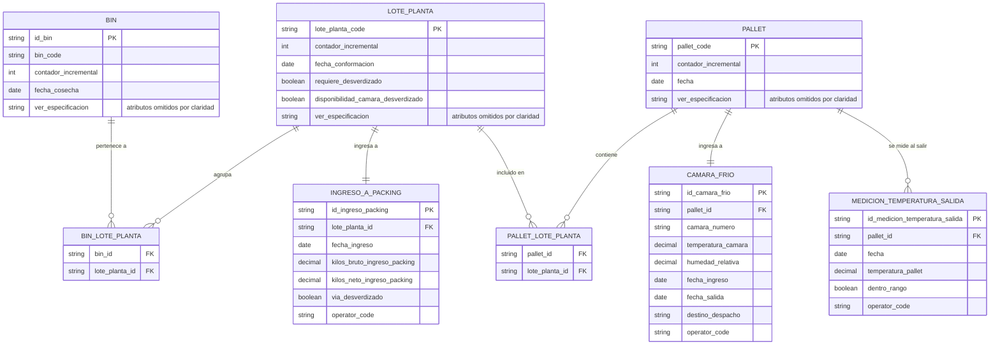
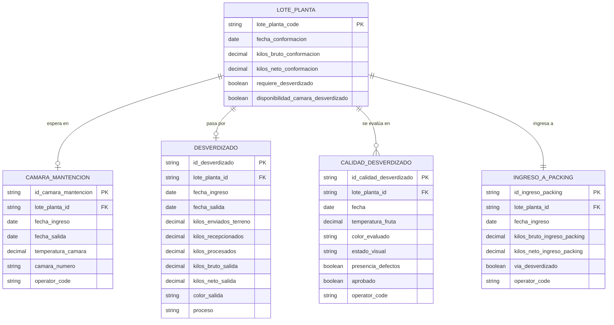
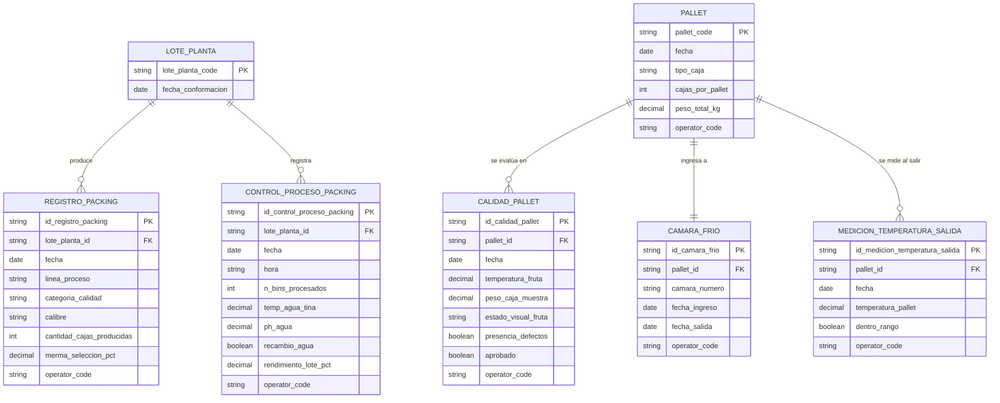

# 03.3 — Diagrama entidad-relación (ERD)
 
> **Subpágina de [[03 Modelo de datos y entidades]].** Este ERD representa el modelo objetivo en Dataverse, que es la base estructural principal de datos del MVP. Dataverse fue solicitado por el cliente para mantener consistencia con sus otros módulos. El ERD está dividido en tres vistas para mayor legibilidad. Las etapas no representadas por alcance se detallan al final con su estado exacto.
 
---
 
Diagrama de entidad-relación del modelo implementado en Dataverse. Dividido en tres vistas para mayor legibilidad.
 
> Este ERD representa únicamente las etapas implementadas en este corte. El flujo operativo completo está documentado en [03.2 - Especificación del modelo](03.2-‐-Especificación-del-modelo).
 
---
 
## Diagrama 1 — Flujo principal
 
Cubre el recorrido central: `Bin → LotePlanta → IngresoAPacking → Pallet → CamaraFrio`.
 

 
> Se omitieron atributos en el diagrama para mejorar su entendimiento visual. Detalle completo en [03.2 - Especificación del modelo](03.2-‐-Especificación-del-modelo).
 
### Restricciones clave
 
| Relación | Cardinalidad | Restricción |
|---|---|---|
| `BIN` → `BIN_LOTE_PLANTA` | Uno a muchos | Un bin aparece en **una sola fila** — no puede estar en dos lotes |
| `LOTE_PLANTA` → `INGRESO_A_PACKING` | Uno a uno | Todo lote tiene **exactamente un** registro de ingreso a packing |
| `LOTE_PLANTA` → `PALLET_LOTE_PLANTA` | Uno a muchos | Un lote aparece en **una sola fila** — no puede estar en dos pallets |
| `PALLET` → `CAMARA_FRIO` | Uno a uno | Un pallet tiene **un solo** registro de cámara. Múltiples pallets pueden referenciar la misma cámara. |
| `PALLET` → `MEDICION_TEMPERATURA_SALIDA` | Uno a muchos | Un pallet puede tener múltiples mediciones de temperatura |
 
---
 
## Diagrama 2 — Etapas previas al packing
 
Cubre las etapas que ocurren entre la conformación del lote y el ingreso a packing, incluyendo la lógica de decisión de desverdizado.
 

 
> Se omitieron atributos en el diagrama para mejorar su entendimiento visual. Detalle completo en [03.2 - Especificación del modelo](03.2-‐-Especificación-del-modelo).
 
### Restricciones clave
 
| Relación | Cardinalidad | Restricción |
|---|---|---|
| `LOTE_PLANTA` → `CAMARA_MANTENCION` | Uno a cero-o-uno | Condicional: solo si `requiere_desverdizado = true` y `disponibilidad_camara_desverdizado = false` |
| `LOTE_PLANTA` → `DESVERDIZADO` | Uno a cero-o-uno | Condicional: solo si `requiere_desverdizado = true` y hay disponibilidad. **Un solo registro** por lote. |
| `LOTE_PLANTA` → `CALIDAD_DESVERDIZADO` | Uno a muchos | Solo aplica si el lote pasó por `DESVERDIZADO`. Pueden registrarse múltiples evaluaciones. |
| `LOTE_PLANTA` → `INGRESO_A_PACKING` | Uno a uno | **Obligatorio para todos los lotes**, con o sin desverdizado |
 
### Lógica de decisión
 
Los campos `requiere_desverdizado` y `disponibilidad_camara_desverdizado` en `LOTE_PLANTA` determinan qué etapas opcionales se crean:
 
- `requiere_desverdizado = false` → el lote avanza directamente a `INGRESO_A_PACKING`
- `requiere_desverdizado = true` y `disponibilidad_camara_desverdizado = false` → se crea `CAMARA_MANTENCION`; cuando la cámara queda disponible, se actualiza el campo y se crea `DESVERDIZADO`
- `requiere_desverdizado = true` y `disponibilidad_camara_desverdizado = true` → se crea `DESVERDIZADO` directamente
 
En todos los casos, `INGRESO_A_PACKING` es obligatorio y cierra el flujo pre-packing.
 
---
 
## Diagrama 3 — Packing y secuencia lineal post-packing
 
Cubre las etapas de packing, armado de pallet y la secuencia lineal: `Pallet → CalidadPallet → CamaraFrio → MedicionTemperaturaSalida`.
 

 
> Se omitieron atributos en el diagrama para mejorar su entendimiento visual. Detalle completo en [03.2 - Especificación del modelo](03.2-‐-Especificación-del-modelo).
 
### Restricciones clave
 
| Relación | Cardinalidad | Restricción |
|---|---|---|
| `LOTE_PLANTA` → `REGISTRO_PACKING` | Uno a muchos | Un lote puede producir **múltiples filas** por categoría, calibre y línea |
| `LOTE_PLANTA` → `CONTROL_PROCESO_PACKING` | Uno a muchos | **Múltiples registros** permitidos por lote si los parámetros cambian en el turno |
| `PALLET` → `CALIDAD_PALLET` | Uno a muchos | Un pallet puede tener múltiples registros de calidad |
| `PALLET` → `CAMARA_FRIO` | Uno a uno | Un pallet tiene **un solo** registro de cámara de frío |
| `PALLET` → `MEDICION_TEMPERATURA_SALIDA` | Uno a muchos | Un pallet puede tener **múltiples** mediciones de temperatura al salir |
 
### Secuencia lineal post-packing
 
El flujo post-packing es lineal y obligatorio para todo pallet:
 
```
Pallet  →  CalidadPallet  →  CamaraFrio  →  MedicionTemperaturaSalida
```
 
Cada entidad en esta secuencia referencia al `pallet` que la origina. No existe una FK directa entre `CalidadPallet` y `CamaraFrio` — la relación se navega siempre desde el pallet.
 
---
 
## Etapas no representadas en este ERD
 
| Etapa | Estado |
|---|---|
| Atemperado | Pendiente — sin definición de campos |
| Control de calidad detallado (CALIDAD 1–5) | Pendiente — excluido temporalmente del contrato funcional |
| Despacho a packing, vaciado, recepción packing | Fuera del alcance del MVP inicial |
| Fruta comercial / exportación | Pendiente de definición |
| Embarque | Fuera del alcance del MVP inicial |
 
---
 
*Subpágina de [03 - Modelo de datos y entidades](03-Modelo-de-datos-y-entidades). Complementa [03.2 - Especificación del modelo](03.2-‐-Especificación-del-modelo).*