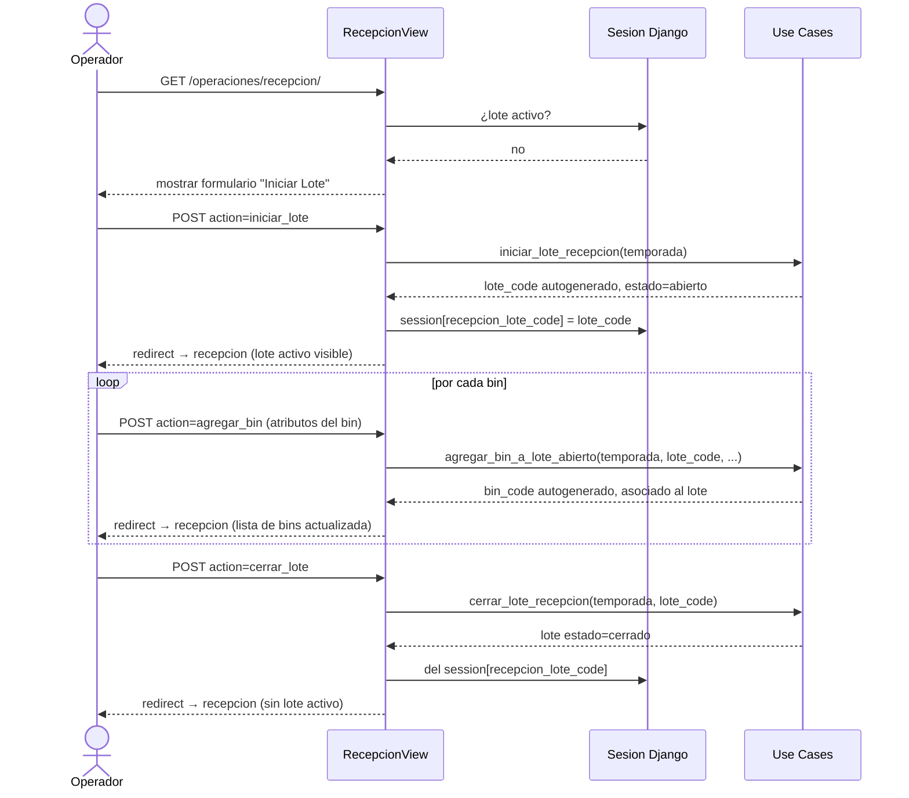

<<<<<<< Updated upstream
=======
# Cambios Técnicos — Iteración 2026-03-31 (b): Integración crf21_etapa_actual

**Branch:** `main`
**Fecha:** 2026-03-31

---

## Resumen iteración 2026-03-31 (b)

Integración de `crf21_etapa_actual` en el backend Dataverse para eliminar la
dependencia funcional del campo `estado` ficticio y disponer de etapa real persistida
en el lote. Javiera habilitó el campo en Power Platform; este commit adapta mapping,
repositorios, casos de uso, vistas, reportería y exportación para usarlo.

### Archivos modificados
- `python-app/src/infrastructure/dataverse/mapping.py`
- `python-app/src/domain/repositories/base.py`
- `python-app/src/infrastructure/dataverse/repositories/__init__.py`
- `python-app/src/infrastructure/sqlite/repositories.py`
- `python-app/src/operaciones/views.py`
- `python-app/src/operaciones/application/use_cases/iniciar_lote_recepcion.py`
- `python-app/src/operaciones/application/use_cases/cerrar_lote_recepcion.py`
- `python-app/src/operaciones/application/use_cases/registrar_camara_mantencion.py`
- `python-app/src/operaciones/application/use_cases/registrar_desverdizado.py`
- `python-app/src/operaciones/application/use_cases/registrar_ingreso_packing.py`
- `python-app/src/operaciones/application/use_cases/registrar_registro_packing.py`
- `python-app/src/operaciones/application/use_cases/registrar_control_proceso_packing.py`
- `python-app/src/operaciones/application/use_cases/cerrar_pallet.py`
- `python-app/src/operaciones/application/use_cases/registrar_calidad_pallet.py`
- `python-app/src/operaciones/application/use_cases/registrar_camara_frio.py`
- `python-app/src/operaciones/application/use_cases/registrar_medicion_temperatura.py`
- `python-app/TECHNICAL_CHANGES.md`
- `python-app/README.md`

### Cambios técnicos clave

#### 1. `mapping.py` — nuevo campo `etapa_actual`

```python
# LOTE_PLANTA_FIELDS
"etapa_actual": "crf21_etapa_actual"
```

Valores posibles: `"Recepcion"`, `"Pesaje"`, `"Mantencion"`, `"Desverdizado"`,
`"Ingreso Packing"`, `"Packing / Proceso"`, `"Paletizado"`,
`"Calidad Pallet"`, `"Camara Frio"`, `"Temperatura Salida"`.

#### 2. `base.py` — `LoteRecord.etapa_actual` y `PalletLoteRepository.find_by_pallet`

`LoteRecord` recibe campo `etapa_actual: Optional[str] = None`. En SQLite siempre
es `None` (se usa `_etapa_lote()` de la vista). En Dataverse se lee desde
`crf21_etapa_actual`.

`PalletLoteRepository.find_by_pallet(pallet_id)` agregado como método no-abstracto
(default: `None`). Dataverse lo implementa para que use cases pallet-nivel
(`calidad_pallet`, `camara_frio`, `medicion_temperatura`) puedan actualizar
la etapa del lote asociado.

#### 3. `repositories/__init__.py` — leer, escribir y resolver etapa

- `_LOTE_SELECT` incluye `crf21_etapa_actual`.
- `_row_to_lote` popula `LoteRecord.etapa_actual` desde el campo OData.
- `DataverseLoteRepository.update` acepta `etapa_actual` en el dict de campos.
- `DataverseLoteRepository.create` acepta `etapa_actual` en el dict `extra`.
- `DataversePalletLoteRepository.find_by_pallet` implementado (OData filter por `_crf21_pallet_id_value`).
- **`resolve_etapa_lote(lote, repos=None) -> str`** — función pública del módulo:
  1. Si `lote.etapa_actual` está persistida, la retorna directamente (**camino feliz**).
  2. Si es `None` y `repos` está disponible, deriva la etapa consultando tablas en orden inverso: `pallet_lotes → camara_frio → ingresos_packing → desverdizados → camara_mantencions → bins`.
  3. Si `repos=None` (bulk listing), retorna `"Recepcion"` como fallback conservador.

#### 4. `sqlite/repositories.py` — fix `SqliteLoteRepository.update`

```python
model_fields = {f.name for f in Lote._meta.get_fields() if hasattr(f, "name")}
safe_fields = {k: v for k, v in fields.items() if k in model_fields}
if safe_fields:
    Lote.objects.filter(pk=lote_id).update(**safe_fields)
```

Evita `FieldError` cuando los use cases (compartidos entre backends) pasan
`etapa_actual` al `update`. En SQLite el campo no existe y se ignora silenciosamente.

#### 5. Use cases — escritura de `etapa_actual` en cada transición

| Use case | Etapa escrita |
|---|---|
| `iniciar_lote_recepcion` | `"Recepcion"` (en `extra` al crear) |
| `cerrar_lote_recepcion` | `"Pesaje"` (en `campos_update`) |
| `registrar_camara_mantencion` | `"Mantencion"` |
| `registrar_desverdizado` | `"Desverdizado"` |
| `registrar_ingreso_packing` | `"Ingreso Packing"` |
| `registrar_registro_packing` | `"Packing / Proceso"` |
| `registrar_control_proceso_packing` | `"Packing / Proceso"` |
| `cerrar_pallet` | `"Paletizado"` (para cada lote nuevo en la relación) |
| `registrar_calidad_pallet` | `"Calidad Pallet"` (via `find_by_pallet`) |
| `registrar_camara_frio` | `"Camara Frio"` (via `find_by_pallet`) |
| `registrar_medicion_temperatura` | `"Temperatura Salida"` (via `find_by_pallet`) |

Las escrituras de etapa son **no-op en SQLite** (campo filtrado por `safe_fields`).
Para use cases pallet-nivel, `find_by_pallet` retorna `None` en SQLite (método
por defecto) → no falla ni bloquea el flujo.

#### 6. `views.py` — uso de `etapa_actual` en vistas

- **`DashboardView._context_dataverse`**: usa `resolve_etapa_lote(l)` para mostrar
  etapa real. KPIs ahora distinguen `lotes_abiertos` (etapa=Recepcion) de
  `lotes_cerrados` (etapa≠Recepcion).
- **`RecepcionView._lote_activo_dataverse`**: si `resolve_etapa_lote(lote) != "Recepcion"`,
  limpia la sesión y bloquea el ingreso de bins (restricción funcional por etapa).
- **`_lotes_enriquecidos_qs`**: detecta backend Dataverse y delega a
  `_lotes_enriquecidos_dataverse()`, usando `etapa_actual` como fuente de etapa
  y estado para filtros y exportación CSV.
- **`_lotes_enriquecidos_dataverse`**: nueva función. `filtro_productor` se ignora
  (requeriría N+1 API calls). `filtro_estado` se mapea a etapa.

### Validación ejecutada

```
manage.py check     → 0 issues
manage.py test operaciones.test → 115/115 OK
Dataverse ping      → OK (UserId confirmado)
list_recent         → 2 lotes, etapa_actual_raw=None, resolve='Recepcion' (fallback correcto)
```

### Limitaciones remanentes

| Brecha | Estado |
|---|---|
| `filtro_productor` en consulta jefatura Dataverse | No aplicable sin bin lookup |
| `lotes_finalizados` en KPI Dataverse | Siempre 0 — no hay equivalente en DV |
| `etapa_actual` registros anteriores | `None` → fallback conservador "Recepcion" |
| Transacciones ACID | Dataverse no soporta; brecha conocida |

---

# Cambios Técnicos — Iteración 2026-03-31: Cierre funcional backend Dataverse

**Branch:** `main`
**Fecha:** 2026-03-31

---

## Resumen iteración 2026-03-31

Cierre funcional del backend Dataverse para el flujo MVP completo. Todos los
repositorios de etapas operacionales pasaron de stubs a implementaciones reales.
Las vistas de recepción y dashboard ahora funcionan en modo `PERSISTENCE_BACKEND=dataverse`.

### Archivos modificados
- `python-app/src/domain/repositories/base.py`
- `python-app/src/infrastructure/dataverse/repositories/__init__.py`
- `python-app/src/operaciones/views.py`
- `python-app/TECHNICAL_CHANGES.md`
- `python-app/README.md`

### Cambios funcionales

#### 1. Nuevos métodos en `domain/repositories/base.py` (no-abstractos)

| Clase | Método | Descripción |
|---|---|---|
| `BinRepository` | `list_by_lote(lote_id)` | Retorna bins de un lote. Default: `[]`. Dataverse lo implementa via tabla de unión. |
| `LoteRepository` | `list_recent(limit=50)` | Retorna lotes recientes ordenados por fecha. Default: `[]`. Dataverse lo implementa via OData `$orderby=createdon desc`. |
| `BinLoteRepository` | `list_by_lote(lote_id)` | Retorna registros bin-lote de un lote. Default: `[]`. |

Estos métodos son **no-abstractos** para no romper las implementaciones SQLite que
acceden a estos datos via ORM directo en las vistas.

#### 2. Repositorios Dataverse completados (`infrastructure/dataverse/repositories/__init__.py`)

Todos los siguientes repositorios pasaron de `NotImplementedError` a implementación real:

| Repositorio | Métodos implementados |
|---|---|
| `DataverseBinRepository` | `list_by_lote` (2 pasos: bin_lote → bins) |
| `DataverseBinLoteRepository` | `list_by_lote` (query directa por lote_id_value) |
| `DataverseLoteRepository` | `list_recent` (OData `$orderby=createdon desc`) |
| `DataverseCamaraMantencionRepository` | `find_by_lote`, `create`, `update` |
| `DataverseDesverdizadoRepository` | `find_by_lote`, `create`, `update` |
| `DataverseCalidadDesverdizadoRepository` | `create`, `list_by_lote` |
| `DataverseIngresoAPackingRepository` | `find_by_lote`, `create` |
| `DataverseRegistroPackingRepository` | `create`, `list_by_lote` |
| `DataverseControlProcesoPackingRepository` | `create`, `list_by_lote` |
| `DataverseCalidadPalletRepository` | `create`, `list_by_pallet` |
| `DataverseCamaraFrioRepository` | `find_by_pallet`, `create`, `update` |
| `DataverseMedicionTemperaturaSalidaRepository` | `create`, `list_by_pallet` |

Se agregaron helpers `_parse_date`, `_parse_decimal`, `_str` para conversión
de valores OData a tipos Python del dominio, y funciones `_row_to_*` para
cada entidad.

#### 3. Correcciones en `operaciones/views.py`

**`DashboardView.get_context_data`** — split en dos ramas según backend:
- `_context_sqlite(temporada)`: comportamiento original con ORM (sin cambios).
- `_context_dataverse()`: usa `repos.lotes.list_recent(limit=50)`. Limitación documentada: `estado` no existe en Dataverse, los contadores de lotes cerrados/finalizados son siempre 0.

**`RecepcionView._lote_activo`** — añadido fallback Dataverse:
- En SQLite: usa `Lote.objects.get(...)` como antes.
- En Dataverse: usa `repos.lotes.find_by_code(temporada, lote_code)`, retorna `LoteRecord`. La plantilla acepta ambos tipos ya que accede solo a atributos comunes (`.lote_code`, `.cantidad_bins`, `.estado`).

**`RecepcionView._bins_de_lote`** — añadido fallback Dataverse:
- En SQLite: usa `lote.bin_lotes.select_related("bin")` como antes.
- En Dataverse: usa `repos.bins.list_by_lote(lote.id)`, retorna `list[BinRecord]`.

### Decisiones técnicas

1. **`estado` derivado en Dataverse**: El campo no existe en el schema Dataverse. En modo Dataverse, `LoteRecord.estado` siempre retorna `"abierto"`. El flujo de cierre de lote funciona porque la vista limpia la sesión (`session.pop`) al llamar `cerrar_lote_recepcion`, no por inspección del estado. Documentado como limitación conocida.

2. **No se fuerzan tablas inexistentes**: `registro_etapas` sigue siendo no-op en Dataverse. `_bins_de_lote` en Dataverse hace dos llamadas HTTP (bin_lote → bins) que es la única forma correcta dado el schema real.

3. **Compatibilidad de templates**: Los templates Django aceptan tanto instancias ORM como dataclasses para atributos simples (`{{ lote.lote_code }}`). Los métodos de relacione ORM (`lote.bin_lotes.select_related`) son evitados en el path Dataverse usando la rama condicional.

### Validación técnica

| Validación | Resultado |
|---|---|
| `python manage.py check` | 0 issues |
| `python manage.py test operaciones.test` | 115/115 OK |
| Ping Dataverse real | OK (UserId confirmado) |
| 13/13 tablas Dataverse accesibles | OK |
| `list_recent` con datos reales | 2 lotes retornados |
| `find_by_lote` CamaraMantencion real | CamaraMantencionRecord con datos reales |
| `find_by_lote` Desverdizado real | found |
| `find_by_lote` IngresoAPacking real | found |
| Filtro OData `_crf21_lote_planta_id_value eq {guid}` | verificado funcional |

### Brechas remanentes (modelo Dataverse)

| Brecha | Estrategia |
|---|---|
| `estado` lote no existe en Dataverse | Retorna `"abierto"` siempre; cierre controlado por sesión |
| `registro_etapas` no existe en Dataverse | No-op con log local; no bloquea el flujo |
| `SequenceCounter` sin tabla Dataverse | Cuenta registros existentes (no atómico; aceptable para MVP) |
| Dashboard no muestra lotes cerrados/finalizados en Dataverse | Limitación conocida; documentada en template y aquí |
| `CalidadPalletMuestra` solo en SQLite | Resuelto en iteracion 2026-04-04 — ver seccion siguiente |

---

# Cambios Tecnicos — Iteracion 2026-04-04: CalidadPalletMuestra + Cierre Issues

**Branch:** `main`
**Fecha:** 2026-04-04

---

## Resumen iteracion 2026-04-04

Cierre del Issue #39 y maratón de avance: creación de la tabla
`crf21_calidad_pallet_muestras` en Dataverse via Metadata API, implementación
del repositorio completo (SQLite + Dataverse), migración de `_save_muestras`
al repo layer, corrección de CSRF en 5 endpoints, mejora del manejo de
excepciones en el auth backend, y creación de scripts standalone de diagnóstico.

### Archivos creados

- `scripts/dataverse/_setup.py`
- `scripts/dataverse/00_check_env.py`
- `scripts/dataverse/01_whoami.py`
- `scripts/dataverse/02_check_tables.py`
- `scripts/dataverse/03_query_bins.py`
- `scripts/dataverse/04_query_lotes.py`
- `scripts/dataverse/05_query_pallets.py`
- `scripts/dataverse/06_query_usuarios.py`
- `scripts/dataverse/07_validate_mapping.py`
- `scripts/dataverse/09_create_calidad_pallet_muestras.py`
- `scripts/dataverse/run_all.py`

### Archivos modificados

- `python-app/src/infrastructure/dataverse/mapping.py`
- `python-app/src/domain/repositories/base.py`
- `python-app/src/infrastructure/dataverse/repositories/__init__.py`
- `python-app/src/infrastructure/sqlite/repositories.py`
- `python-app/src/operaciones/views.py`
- `python-app/src/operaciones/api/views.py`
- `python-app/src/core/dataverse_views.py`
- `python-app/src/usuarios/auth_backend.py`
- `DATAVERSE_GUIDE.md`
- `python-app/TECHNICAL_CHANGES.md`

### Cambios tecnicos clave

#### 1. Tabla `crf21_calidad_pallet_muestras` creada en Dataverse

Script `09_create_calidad_pallet_muestras.py` crea la tabla via Metadata API:

- Entidad con `SchemaName = "crf21_calidad_pallet_muestra"`
- Atributo primario `crf21_nombre` (String, IsPrimaryName=True)
- Campos: `crf21_numero_muestra` (Integer), `crf21_temperatura_fruta` (Decimal),
  `crf21_peso_caja_muestra` (Decimal), `crf21_n_frutos` (Integer),
  `crf21_aprobado` (Boolean), `crf21_observaciones` (Memo),
  `crf21_rol` (String), `crf21_operator_code` (String)
- Relacion lookup `crf21_pallet_id` → `crf21_pallet` (OneToManyRelationship,
  CascadeDelete=RemoveLink)

#### 2. `mapping.py` — nuevas constantes

```python
ENTITY_SET_CALIDAD_PALLET_MUESTRA  = "crf21_calidad_pallet_muestras"
LOGICAL_NAME_CALIDAD_PALLET_MUESTRA = "crf21_calidad_pallet_muestra"
CALIDAD_PALLET_MUESTRA_FIELDS = {
    "id":               "crf21_calidad_pallet_muestraid",
    "pallet_id":        "crf21_pallet_id",
    "pallet_id_value":  "_crf21_pallet_id_value",
    "numero_muestra":   "crf21_numero_muestra",
    "temperatura_fruta": "crf21_temperatura_fruta",
    "peso_caja_muestra": "crf21_peso_caja_muestra",
    "n_frutos":         "crf21_n_frutos",
    "aprobado":         "crf21_aprobado",
    "observaciones":    "crf21_observaciones",
    "rol":              "crf21_rol",
    "operator_code":    "crf21_operator_code",
    "created_at":       "createdon",
    "updated_at":       "modifiedon",
}
```

#### 3. `domain/repositories/base.py` — nuevo record y repositorio abstracto

```python
@dataclass
class CalidadPalletMuestraRecord:
    id: Any
    pallet_id: Any
    numero_muestra: Optional[int] = None
    temperatura_fruta: Optional[Decimal] = None
    peso_caja_muestra: Optional[Decimal] = None
    n_frutos: Optional[int] = None
    aprobado: Optional[bool] = None
    observaciones: str = ""
    operator_code: str = ""
    source_system: str = "local"
    rol: str = ""

class CalidadPalletMuestraRepository(ABC):
    def create(pallet_id, *, operator_code, source_system, extra) -> CalidadPalletMuestraRecord
    def list_by_pallet(pallet_id) -> list[CalidadPalletMuestraRecord]
```

`Repositories` dataclass: campo `calidad_pallet_muestras: CalidadPalletMuestraRepository`
agregado entre `calidad_pallets` y `camara_frios`.

#### 4. `DataverseCalidadPalletMuestraRepository` y `SqliteCalidadPalletMuestraRepository`

Ambos implementan `create` y `list_by_pallet`. El Dataverse usa
`@odata.bind` para el lookup al pallet. El SQLite usa `CalidadPalletMuestra.objects.create`.

Registrados en sus respectivos factories (`build_dataverse_repositories`,
`build_sqlite_repositories`).

#### 5. `PaletizadoView._save_muestras` migrado al repo layer

**Antes:** llamaba `CalidadPalletMuestra.objects.create(pallet=pallet_orm, ...)` directamente.
Muestras no se sincronizaban a Dataverse.

**Despues:** usa `repos.calidad_pallet_muestras.create(pallet_id, extra={...})`.
El pallet_id se obtiene via `repos.pallets.find_by_code(temporada, pallet_code)`,
funcional en ambos modos (SQLite y Dataverse).

El import de `CalidadPalletMuestra` (ORM) fue removido de `views.py`.

#### 6. Fix CSRF en 5 endpoints

| Archivo | Endpoints | Cambio |
|---|---|---|
| `operaciones/api/views.py` | `api_registrar_bin`, `api_crear_lote`, `api_cerrar_pallet`, `api_registrar_evento` | Removido `@csrf_exempt` |
| `core/dataverse_views.py` | `save_first_bin_code` | Removido `@csrf_exempt` |

#### 7. `usuarios/auth_backend.py` — excepciones acotadas

`except Exception` generico reemplazado por tres handlers especificos:
- `DataverseAuthError` → `logger.error` con mensaje de credenciales
- `DataverseAPIError` → `logger.error` con mensaje de API
- `Exception` fallback → `logger.exception` (incluye traceback)

### Diagnostico previo a la implementacion

Ejecutado `scripts/dataverse/run_all.py` con resultados:
- Auth: PASS (WhoAmI OK)
- 15 tablas originales: PASS (100% existentes con datos reales)
- `07_validate_mapping.py`: 15/15 entidades PASS, 100% campo a campo coincidente
- `crf21_registro_etapas`: NO EXISTE — esperado (gap conocido Issue #39)
- `crf21_calidad_pallet_muestras`: NO EXISTE — creada en esta iteracion

### Validacion final

```
python manage.py test   -> 196/196 OK (0 fallos, 0 errores)
02_check_tables.py      -> 16/16 tablas PASS incluida crf21_calidad_pallet_muestras
```

### Brechas remanentes

| Brecha | Estado |
|---|---|
| `crf21_registro_etapas` no existe en Dataverse | No-op con log; no bloquea el flujo. Gap conocido Issue #39. |
| `SequenceCounter` sin tabla Dataverse | Cuenta registros (no atomico; aceptable para MVP) |
| Transacciones ACID | Dataverse no soporta; brecha conocida |

---

# Cambios Tecnicos — Iteracion 2026-03-30: Flujo Operativo con Contexto de Lote: Flujo Operativo con Contexto de Lote

**Branch:** `main`
**Fecha:** 2026-03-30

---

## Resumen iteración 2026-03-30

Avance funcional sobre el flujo operativo: recepción con lote abierto y campos base bloqueados,
selectores de lote en desverdizado e ingreso packing, consulta jefatura con datos reales,
dashboard con KPIs reales, y DesverdizadoForm refactorizado.

### Archivos modificados
- `python-app/src/operaciones/forms.py`
- `python-app/src/operaciones/views.py`
- `python-app/src/operaciones/templates/operaciones/recepcion.html`
- `python-app/src/operaciones/templates/operaciones/desverdizado.html`
- `python-app/src/operaciones/templates/operaciones/ingreso_packing.html`
- `python-app/src/operaciones/templates/operaciones/dashboard.html`
- `python-app/src/operaciones/templates/operaciones/consulta.html`

### Cambios funcionales
1. **Recepcion** — nuevo flujo de 3 acciones: `iniciar`, `agregar_bin`, `cerrar`.
   El `lote_code` se almacena en sesión. Tras el primer bin, los campos base del lote
   (codigo_productor, tipo_cultivo, variedad_fruta, color, fecha_cosecha) se bloquean
   como readonly. El backend valida incompatibilidades entre bins del mismo lote.
2. **BinForm** — añadidos `tipo_cultivo`, `numero_cuartel`, `color` (necesarios para
   generación del bin_code y para campos base del lote).
3. **IniciarLoteForm** / **CerrarLoteForm** — nuevos formularios para el flujo de lote abierto.
4. **DesverdizadoForm** — `proceso` renombrado a `color` + `horas_desverdizado`. El campo
   `color` mapea a `color_salida` en el modelo; `horas_desverdizado` se persiste en `proceso`
   como texto (pendiente: agregar columna `horas_desverdizado` al modelo Desverdizado).
5. **DesverdizadoView** — muestra selector de lotes cerrados pendientes; auto-selección de
   tab mantencion/desverdizado según disponibilidad_camara del lote.
6. **IngresoPackingView** — muestra selector de lotes pendientes; `via_desverdizado` se
   auto-detecta desde el historial del lote.
7. **ConsultaJefaturaView** — datos reales con etapa derivada, filtros por productor y estado.
8. **DashboardView** — KPIs reales desde DB (lotes abiertos/cerrados, bins hoy, total lotes).

### Decisiones técnicas
- Los campos base del lote se guardan en `request.session["lote_activo_campos_base"]`.
- La función `_etapa_lote()` determina la etapa actual revisando existencia de registros asociados.
- Los selectores de lote en desverdizado e ingreso packing usan ORM directo en la vista
  (consultas de lectura, no pasan por repositorios). Compatible con SQLite y Dataverse.

### Brechas pendientes
- `horas_desverdizado`: agregar campo al modelo `Desverdizado` en próxima migración.
- Etapas proceso/control/paletizado/camaras: reciben `lote_pendientes` en contexto pero
  aún piden `lote_code` manual (pendiente mismo patrón de selector).
- Calidad de cítricos: múltiples muestras por pallet no implementadas aún.
- Tests de vistas: no existen tests de integración para las vistas web.

---

## Iteración 2026-03-30 (patch): Fecha/hora en tiempo real y via_desverdizado oculto

### Archivos modificados
- `python-app/src/operaciones/templates/operaciones/control.html`
- `python-app/src/operaciones/templates/operaciones/pesaje.html`
- `python-app/src/operaciones/templates/operaciones/ingreso_packing.html`

### Cambios funcionales

1. **Fecha y hora en tiempo real — todas las vistas**
   Se añadió el snippet JS de auto-fill a las dos vistas que faltaban (`control.html` y `pesaje.html`).
   Todas las vistas operacionales tienen ahora el comportamiento uniforme:
   - `input[type="date"]` → pre-poblado con la fecha local del dispositivo al cargar la página.
   - `input.campo-hora` → pre-poblado con la hora local (HH:MM) al cargar la página.
   El valor solo se aplica si el campo está vacío; el usuario puede modificarlo libremente.
   Vistas cubiertas: `recepcion`, `desverdizado`, `ingreso_packing`, `proceso`, `control`, `pesaje`, `paletizado`, `camaras`.

2. **`via_desverdizado` oculto en Ingreso Packing**
   El campo `via_desverdizado` dejó de ser un control visible en el formulario de ingreso a packing.
   - Se mueve al **panel de contexto del lote** como dato informativo ("Via desv.: Sí / No").
   - Se envía automáticamente al backend mediante un `<input type="hidden" name="via_desverdizado">`.
   - El valor se establece por JS al seleccionar el lote: `"on"` si `LOTES_DATA[code].via_desverdizado === true`, `""` si `false` (Django BooleanField interpreta ausencia de valor como `False`).
   - El operador no puede modificarlo; queda determinado por el historial del lote (existencia de registro de desverdizado).

---

>>>>>>> Stashed changes
# Cambios Técnicos — Generación Dinámica de Códigos, Flujo de Recepción con Lote Abierto y Adaptación al Schema Real de Dataverse

**Branch:** `feature/mvp-dataverse-backend-switch`
**Fecha:** 2026-03-29
**Migración aplicada:** `0007_lote_estado_temporada_sequence_pallet_lote_unique`

---

## Resumen

Este documento describe los cambios técnicos realizados para alinear el MVP con el flujo operativo real acordado con el cliente:

1. Los códigos de Bin, LotePlanta y Pallet se generan automáticamente en backend. El usuario no los ingresa.
2. El LotePlanta se crea al **iniciar** la recepción y permanece abierto mientras se agregan bins.
3. El correlativo de LotePlanta es **por temporada**, no reinicia por día.
4. Un lote no puede pertenecer a más de un pallet (restricción en base de datos).
5. El estado del lote se gestiona explícitamente: `abierto → cerrado → finalizado/anulado`.
6. El backend se adapta al schema **real** de Dataverse (prefijo `crf21_`, validado el 2026-03-29).

---

## 1. Cambios en el modelo de datos

### 1.1 Nuevo enum `LotePlantaEstado`

```python
class LotePlantaEstado(models.TextChoices):
    ABIERTO    = "abierto"
    EN_PROCESO = "en_proceso"
    CERRADO    = "cerrado"
    FINALIZADO = "finalizado"
    ANULADO    = "anulado"
```

### 1.2 Nuevos campos en `Lote`

| Campo | Tipo | Default | Descripción |
|---|---|---|---|
| `estado` | CharField (choices) | `abierto` | Estado del ciclo de vida del lote |
| `temporada_codigo` | CharField | `""` | Código explícito de temporada. Ej: `2025-2026` |
| `correlativo_temporada` | PositiveIntegerField | null | Correlativo ascendente dentro de la temporada |

### 1.3 Nuevo modelo `SequenceCounter`

Tabla de correlativos para generación dinámica de códigos (solo SQLite). El backend Dataverse determina el correlativo contando registros existentes.

```
operaciones_sequence_counter
  entity_name  VARCHAR(50)  — 'lote', 'bin', 'pallet'
  dimension    VARCHAR(50)  — temporada_codigo (lote) o YYYYMMDD (pallet) o combinacion de campos (bin)
  last_value   INT          — último valor asignado
  updated_at   DATETIME
  UNIQUE (entity_name, dimension)
```

El acceso es atómico vía `SELECT FOR UPDATE` para garantizar unicidad en concurrencia (SQLite).

### 1.4 Unicidad de lote en `PalletLote`

Se agregó la restricción `uq_pallet_lote_lote_unico` sobre el campo `lote` de la tabla `operaciones_pallet_lote`. Garantiza a nivel de base de datos que un lote no puede estar en más de un pallet.

---

## 2. Nuevos servicios

### `operaciones/services/season.py`

```python
resolve_temporada_codigo(fecha_operativa=None) → str
```

Resuelve el código de temporada desde la fecha. Regla: mes ≥ 10 → `{año}-{año+1}`, mes < 10 → `{año-1}-{año}`.

Ejemplos:
- `2025-10-01` → `"2025-2026"`
- `2026-01-15` → `"2025-2026"`
- `2026-10-01` → `"2026-2027"`

### `operaciones/services/sequences.py`

```python
get_next_sequence(entity_name: str, dimension: str) → int
```

Obtiene el siguiente correlativo para la entidad y dimensión dadas. Operación atómica bajo transacción Django (SQLite). En Dataverse el correlativo se determina contando registros existentes.

### `operaciones/services/code_generators.py`

| Función | Formato generado | Ejemplo |
|---|---|---|
| `build_bin_code(codigo_productor, tipo_cultivo, variedad_fruta, numero_cuartel, fecha_cosecha)` | `{cod_prod}-{cultivo}-{variedad}-{cuartel}-{DDMMYY}-{NNN}` | `AG01-LM-Eur-C05-290326-001` |
| `build_lote_code(temporada_codigo, correlativo)` | `LP-TTTT-TTTT-NNNNNN` | `LP-2025-2026-000001` |
| `build_pallet_code(fecha)` | `PA-YYYYMMDD-NNNN` | `PA-20260329-0012` |
| `next_lote_correlativo(temporada_codigo)` | devuelve `(lote_code, correlativo)` | — |

**Formato `bin_code`** — sigue la hoja "Código de barra" del Excel del cliente:
- `{codigo_productor}`: código de la empresa productora (ej: `AG01`)
- `{tipo_cultivo}`: abreviatura del cultivo (ej: `LM`)
- `{variedad_fruta}`: nombre de variedad (ej: `Eur`)
- `{numero_cuartel}`: identificador del cuartel (ej: `C05`)
- `{DDMMYY}`: fecha de cosecha en formato día-mes-año abreviado (ej: `290326`)
- `{NNN}`: correlativo diario de 3 dígitos, independiente por combinación de los 5 campos anteriores

---

## 3. Nuevos casos de uso

### `iniciar_lote_recepcion(payload)`

Crea un lote planta en estado `abierto` al iniciar una sesión de recepción. El `lote_code` y `correlativo_temporada` se generan automáticamente.

**Payload requerido:** `temporada`
**Payload opcional:** `temporada_codigo`, `operator_code`, `fecha_conformacion`

**Resultado:**
```json
{
  "lote_id": 1,
  "lote_code": "LP-2025-2026-000001",
  "temporada_codigo": "2025-2026",
  "correlativo_temporada": 1,
  "estado": "abierto"
}
```

### `agregar_bin_a_lote_abierto(payload)`

Registra un bin (generando su `bin_code`) y lo asocia inmediatamente al lote abierto indicado.

**Validaciones:**
- El lote debe existir y estar en estado `abierto`.
- El bin no puede estar ya asignado a otro lote.

**Payload requerido:** `temporada`, `lote_code`
**Payload opcional:** `fecha_cosecha`, `codigo_productor`, `tipo_cultivo`, `variedad_fruta`, `numero_cuartel`, `kilos_bruto_ingreso`, etc.

**Resultado:**
```json
{
  "bin_id": 5,
  "bin_code": "AG01-LM-Eur-C05-290326-001",
  "lote_id": 1,
  "lote_code": "LP-2025-2026-000001",
  "bin_lote_id": 3
}
```

### `cerrar_lote_recepcion(payload)`

Cierra el lote: cambia estado de `abierto` a `cerrado`. Después del cierre no se pueden agregar bins.

**Validaciones:**
- El lote debe estar en estado `abierto`.
- El lote debe tener al menos un bin asociado.

**Payload requerido:** `temporada`, `lote_code`

---

## 4. Cambios en casos de uso existentes

### `registrar_bin_recibido`

- `bin_code` ya **no es requerido** en el payload. Si no se provee, se genera automáticamente via `build_bin_code()` con los 5 campos base del `extra`.
- Si se provee explícitamente, se respeta (compatibilidad con integraciones upstream).

### `crear_lote_recepcion`

- `lote_code` ya **no es requerido** en el payload. Si no se provee, se genera con correlativo por temporada.
- `bin_codes` sigue siendo requerido (lista de bins a asociar).
- El lote se crea directamente en estado `cerrado` al usar este caso de uso (flujo legacy).

### `cerrar_pallet`

- `pallet_code` ya **no es requerido** en el payload. Si no se provee, se genera via `build_pallet_code()`.
- `lote_codes` sigue siendo requerido.

---

## 5. Cambios en formularios y vistas

### `BinForm`

Eliminado el campo `bin_code`. El usuario ya no ingresa el código del bin.

### `LoteForm`

Eliminado el campo `lote_code`. El usuario ya no ingresa el código del lote.

### `RecepcionView`

El payload ya no incluye `bin_code`.

### `PesajeView`

El payload ya no incluye `lote_code`.

---

## 6. Flujo de recepción — antes y después

### Antes (flujo legacy — aún disponible)

```
1. Operador ingresa bins sueltos uno a uno (con bin_code manual)
2. Operador conforma lote ingresando lote_code manual y listado de bin_codes
```

### Después (nuevo flujo preferido)

```
1. Iniciar recepción → lote_code generado automáticamente (estado: abierto)
2. Capturar atributos del bin → bin_code generado automáticamente
3. Bin queda asociado al lote abierto en la misma operación
4. Repetir paso 2-3 por cada bin
5. Cerrar lote → estado cambia a "cerrado"
```

---

## 7. Reglas de negocio enforced

| Regla | Mecanismo |
|---|---|
| bin_code único por temporada | UniqueConstraint en DB |
| lote_code único por temporada | UniqueConstraint en DB |
| pallet_code único por temporada | UniqueConstraint en DB |
| Un bin en un solo lote | Validación en use case + BinLote unique constraint |
| Un lote en un solo pallet | UniqueConstraint `uq_pallet_lote_lote_unico` en DB |
| Correlativo de lote no se reutiliza | SequenceCounter nunca decrementa |
| No agregar bins a lote cerrado | Validación de estado en `agregar_bin_a_lote_abierto` |
| Cerrar lote requiere mínimo un bin | Validación en `cerrar_lote_recepcion` |

---

## 8. Adaptación al schema real de Dataverse

### 8.1 Validación del schema (2026-03-29)

El schema real de Dataverse fue validado via `GET /api/dataverse/check_tables/`. Las 14 tablas responden correctamente con sus registros de muestra. El publisher usa el prefijo **`crf21_`** (no `CaliPro_` como se supuso antes de la validación).

### 8.2 Corrección del mapping (`infrastructure/dataverse/mapping.py`)

El archivo fue reescrito completamente para reflejar los nombres reales:

| Concepto | Antes (supuesto) | Después (real) |
|---|---|---|
| Entidades | `CaliPro_bins`, `CaliPro_loteplantas` | `crf21_bins`, `crf21_lote_plantas` |
| Campos | `CaliPro_bincode`, `CaliPro_codigoproductor` | `crf21_bin_code`, `crf21_codigo_productor` |
| Junction bins-lotes | `CaliPro_binloteplantas` | `crf21_bin_lote_plantas` |
| Junction pallets-lotes | `CaliPro_palletloteplantas` | `crf21_lote_planta_pallets` |

### 8.3 Campos del dominio sin equivalente en Dataverse

Los siguientes campos existen en el dominio Django pero **no tienen columna en Dataverse**. El backend los gestiona localmente o los ignora al persistir:

| Campo dominio | Tabla afectada | Estrategia backend |
|---|---|---|
| `temporada` | bins, lotes, pallets | No se persiste; se filtra por rango de fechas si es necesario |
| `lote_code` | lote_plantas | Se almacena en `crf21_id_lote_planta` |
| `pallet_code` | pallets | Se almacena en `crf21_id_pallet` |
| `estado` | lote_plantas | No existe en Dataverse; `LoteRecord` lo retorna como `"abierto"` por defecto |
| `temporada_codigo` | lote_plantas | No existe en Dataverse; se retorna vacío |
| `correlativo_temporada` | lote_plantas | No existe en Dataverse; se retorna `None` |
| `is_active` | bins, lotes, pallets | Se lee de `statecode == 0` (campo estándar Dataverse) |

### 8.4 `SequenceCounter` sin tabla en Dataverse

No existe tabla de correlativos en Dataverse y el principio del proyecto establece que **Dataverse no se modifica**. Se implementó `DataverseSequenceCounterRepository` que determina el siguiente correlativo **contando registros existentes**:

| Entidad | Estrategia de conteo |
|---|---|
| `bin` | Cuenta bins con `crf21_bin_code` que empiece por el prefijo de dimensión (`cod_prod-cultivo-variedad-cuartel-fecha-`) |
| `lote` | Cuenta lotes con `crf21_fecha_conformacion` en el rango de fechas de la temporada |
| `pallet` | Cuenta pallets con `crf21_fecha` en el día de la dimensión |

> Esta estrategia no es atómica. Race conditions son posibles bajo alta concurrencia. Aceptable para la escala del MVP.

### 8.5 `RegistroEtapa` sin tabla en Dataverse

No existe tabla `registro_etapas` en el schema real de Dataverse. `DataverseRegistroEtapaRepository` es un **no-op** que registra los eventos en el log local (Django `logging`) sin persistirlos en Dataverse. Los casos de uso funcionan sin error porque el registro de eventos es informacional y no bloquea la lógica de negocio.

### 8.6 Tests de conexión Dataverse validados (sección 11 de DATAVERSE_GUIDE.md)

Todos los endpoints de prueba documentados en el guide responden correctamente:

| Endpoint | Resultado |
|---|---|
| `GET /api/dataverse/ping/` | ✅ Conexión exitosa, user/org/BU retornados |
| `GET /api/dataverse/check_tables/` | ✅ 14/14 tablas accesibles con registro de muestra |
| `GET /api/dataverse/get_first_bin_code/` | ✅ `AG01-CE-Santi-C05-280326-01` |
| `POST /api/dataverse/save_first_bin_code/` | ✅ success |

---

## 9. Repositorios Dataverse (`infrastructure/dataverse/repositories/`)

### Estado de implementación

| Repositorio | Estado |
|---|---|
| `DataverseBinRepository` | ✅ Implementado (find_by_code, create con extra, filter_by_codes) |
| `DataverseLoteRepository` | ✅ Implementado (find_by_code, create, filter_by_codes, update) |
| `DataversePalletRepository` | ✅ Implementado (find_by_code, get_or_create) |
| `DataverseBinLoteRepository` | ✅ Implementado (create, find_existing_assignments) |
| `DataversePalletLoteRepository` | ✅ Implementado (get_or_create, find_by_lote) |
| `DataverseRegistroEtapaRepository` | ✅ No-op (sin tabla en Dataverse, log local) |
| `DataverseSequenceCounterRepository` | ✅ Implementado (conteo de registros existentes) |
| `DataverseCamaraMantencionRepository` | 🔲 Stub — pendiente validación de uso real |
| `DataverseDesverdizadoRepository` | 🔲 Stub — pendiente validación de uso real |
| `DataverseCalidadDesverdizadoRepository` | 🔲 Stub — pendiente validación de uso real |
| `DataverseIngresoAPackingRepository` | 🔲 Stub — pendiente validación de uso real |
| `DataverseRegistroPackingRepository` | 🔲 Stub — pendiente validación de uso real |
| `DataverseControlProcesoPackingRepository` | 🔲 Stub — pendiente validación de uso real |
| `DataverseCalidadPalletRepository` | 🔲 Stub — pendiente validación de uso real |
| `DataverseCamaraFrioRepository` | 🔲 Stub — pendiente validación de uso real |
| `DataverseMedicionTemperaturaSalidaRepository` | 🔲 Stub — pendiente validación de uso real |

Los stubs elevan `NotImplementedError` con mensaje descriptivo si son invocados.

---

## 10. Tests

| Suite | Tests | Estado |
|---|---|---|
| `test_sequences_and_codes` | 17 | ✅ Pasan |
| `test_iniciar_lote_recepcion` | 16 | ✅ Pasan |
| `operaciones.tests` (nuevos) | 28 | ✅ Pasan |
| Suites existentes | 82 | ✅ Pasan |
| **Total** | **143** | **✅ OK** |

Para correr todos:

```bash
cd python-app/src
python manage.py test operaciones.test
```

---

## 11. Conexión frontend → backend: flujo de recepción con lote abierto (2026-03-30)

### Problema resuelto

La UI web seguía usando el flujo legacy (bins sueltos + conformación manual de lote). Los casos de uso `iniciar_lote_recepcion`, `agregar_bin_a_lote_abierto` y `cerrar_lote_recepcion` ya existían en backend pero no estaban conectados a ninguna vista web.

### Flujo nuevo implementado en frontend



### Archivos modificados

| Archivo | Cambio |
|---|---|
| `operaciones/views.py` | `RecepcionView` reescrita con tres acciones; `DashboardView` usa datos reales; `PesajeView` marcada como legacy |
| `operaciones/templates/operaciones/recepcion.html` | Reescrito: estado sin lote / estado con lote abierto / lista de bins real |
| `operaciones/templates/operaciones/pesaje.html` | Aviso de flujo legacy añadido |
| `operaciones/templates/operaciones/dashboard.html` | KPIs y tabla de lotes recientes desde DB; navegación directa entre etapas |
| `domain/repositories/base.py` | Nuevos métodos abstractos: `BinRepository.list_by_lote`, `LoteRepository.list_recent`, `BinLoteRepository.list_by_lote` |
| `infrastructure/sqlite/repositories.py` | Implementaciones SQLite de los tres métodos nuevos |
| `infrastructure/dataverse/repositories/__init__.py` | Stubs de los tres métodos (log + retorno vacío; documentado como pendiente) |
| `operaciones/tests.py` | 28 tests nuevos: use cases + repository queries + integración de vistas |

### Sesión Django

La clave `recepcion_lote_code` en sesión almacena el `lote_code` activo. Ciclo de vida:
- Se escribe al iniciar lote (`action=iniciar_lote`).
- Se lee en cada GET y en `action=agregar_bin`.
- Se elimina al cerrar lote (`action=cerrar_lote`) o si el lote ya no existe en DB.

### Estado de soporte por backend

| Funcionalidad | SQLite | Dataverse |
|---|---|---|
| Iniciar lote | ✅ Funcional | ✅ Funcional (estado no persiste en DV) |
| Agregar bin al lote | ✅ Funcional | ✅ Funcional |
| Cerrar lote | ✅ Funcional | ✅ (estado no persiste en DV) |
| Listar bins del lote activo | ✅ Funcional | ⚠️ Stub — retorna lista vacía |
| Dashboard con datos reales | ✅ Funcional | ⚠️ Stub — retorna lista vacía |

### Pendiente

- Dataverse: implementar `list_by_lote` para `BinRepository` y `BinLoteRepository` (requiere query OData sobre la tabla `crf21_bin_lote` filtrando por `lote_id`).
- Dataverse: implementar `list_recent` para `LoteRepository` (requiere filtro por rango de fechas dado que `temporada` no existe en DV).
- Template de desverdizado/ingreso-packing: todavía requieren que el operador ingrese manualmente el `lote_code`. Considerar persistir el lote cerrado más reciente en sesión para pre-rellenarlo automáticamente.
